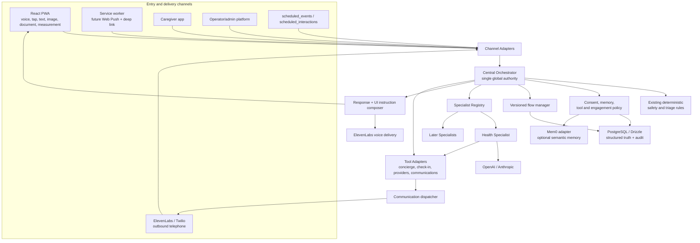
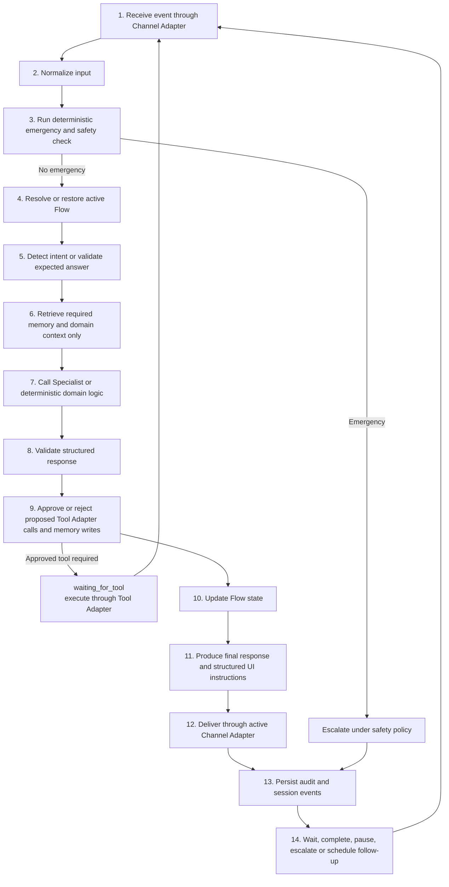
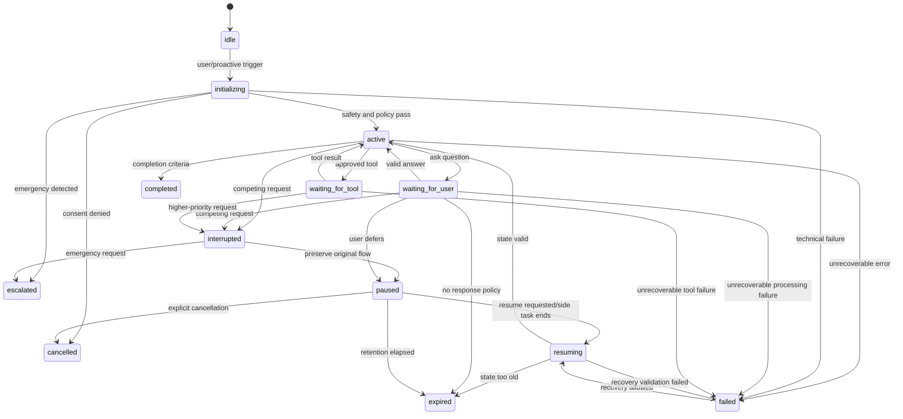
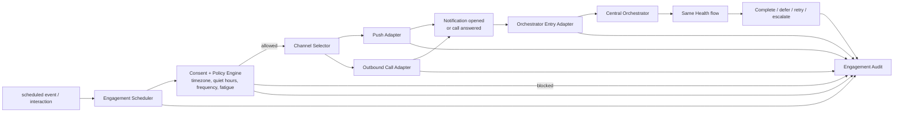

# VYVA Current-to-Target Architecture Migration Plan

**Plan date:** 30 July 2026  
**Repository:** `vyva-home-master-true-v1`  
**Evidence baseline:** `docs/ARCHITECTURE_ASSESSMENT.md` plus targeted reinspection of current source  
**Planning constraint:** incremental evolution only; no rewrite and no application-code changes in this planning task

## Evidence and terminology

This plan separates three kinds of statements:

- **Current fact** — directly evidenced by repository code, schema, routes, tests, or configuration.
- **Interpretation** — an architectural conclusion drawn from those facts.
- **Recommendation** — a proposed target or migration action that does not yet exist.

“Orchestrator” in the current repository refers to distributed behavior across `server/routes/router.ts`, voice policy/context modules, ElevenLabs hosted agents, client voice navigation, workflow registries, and domain services. **Central Orchestrator** in the target means one backend-owned authority over conversation and flow state. The target must not be confused with adding another independent router beside the existing ones.

This plan uses the following terms consistently:

- **Central Orchestrator:** the global conversation and flow authority. It alone owns active-flow selection, interruptions, safety precedence, memory policy, tool authorization, final user-facing responses, UI synchronization, proactive engagement and escalation.
- **Domain Supervisor:** an optional coordinator for related logic and flows inside one broad domain. It has no global conversation authority and cannot override the Central Orchestrator.
- **Specialist:** a bounded domain reasoning component that returns a structured proposal to the Central Orchestrator.
- **Flow:** a versioned user journey or process with explicit state, expected input and completion criteria.
- **Channel Adapter:** an adapter for voice, PWA, telephone, touch, text, caregiver or operator interaction.
- **Tool Adapter:** a boundary around an external action, domain service or provider integration.

Any product description of VYVA as an “operating system” is a product metaphor only. It does not imply an operating-system kernel, process model or infrastructure architecture in this technical plan.

---

## 1. Executive Summary

### How close the current system is

VYVA is **architecturally adjacent to, but not yet at, the target**.

Current facts:

- `server/routes/router.ts` performs deterministic emergency checks, intent classification, specialist-domain selection, session updates, Mem0 retrieval, context assembly, and ElevenLabs agent selection.
- `server/lib/voiceContext.ts` already builds rich, domain-filtered context from PostgreSQL.
- `server/lib/voiceAgentPolicy.ts` and `server/lib/voiceConversationPlans.ts` define app-side operating and handoff rules.
- `src/hooks/useVyvaVoice.ts`, `src/lib/voiceNavigation.ts`, `VoiceActionContext`, `VoiceCanvasContext`, and `voiceCanvasBridge.ts` already synchronize parts of speech, navigation, tools, and visual state.
- shared workflow, readiness, receipt, cross-pillar recovery, and execution-observability contracts already exist.
- scheduled interactions, quiet hours, channel preferences, call/message limits, communication logs, Twilio dispatch, ElevenLabs outbound calls, check-in no-response monitoring, and caregiver alerts are implemented.

Partially implemented:

- orchestration responsibilities exist but are distributed;
- session state exists but does not model one active resumable flow;
- specialists exist as hosted voice agents, prompt personas, deterministic engines, and domain endpoints, but do not share one structured specialist contract;
- screen and voice exchange typed events for selected flows, but they do not enter one backend-owned event stream;
- Mem0 retrieval and writes exist, but the router/provider integration effectively owns policy case by case;
- proactive communication exists for SMS, WhatsApp, email, Twilio voice, and specific ElevenLabs calls, but does not converge through a single Central Orchestrator entry;
- consent and channel controls exist but are not one execution-time proactive policy decision;
- voice timeline and domain records provide observability, but not a complete causally linked orchestration audit.

Genuinely missing:

- one backend authority for active flow, interruption, pause/resume, specialist results, final response, UI instructions, tool authorization, memory writes, and proactive entry;
- a standard specialist request/response contract;
- one typed interaction-event envelope across voice, tap, text, file, tool, and system events;
- a shared flow lifecycle and compatibility store;
- PWA push subscriptions, notification permission UX, push delivery, service-worker `push`/`notificationclick` handlers, deep-link restoration, and notification outcome tracking;
- a complete proactive engagement audit record;
- durable queue/lease semantics for multi-instance scheduling;
- version-controlled hosted ElevenLabs agent definitions.

### Why incremental migration is safer

The current production path already combines sensitive health logic, real voice sessions, external calls/messages, caregiver access, subscriptions, and broad UI behavior. Replacing it would put deterministic safety, consent, provider receipts, and working user journeys at risk simultaneously.

The safer approach is to:

1. define contracts;
2. add a compatibility Central Orchestrator shell around the existing router;
3. shadow and compare decisions;
4. move one prevention-first Health flow behind a flag;
5. add PWA and outbound-call entry adapters to that same flow;
6. migrate other domains only after evidence proves parity.

### Highest-risk gaps

1. Hosted ElevenLabs agents and the backend can both influence routing and tool use.
2. frontend and backend do not share a canonical active-flow record;
3. tapped and spoken answers are only unified in selected paths;
4. Mem0 writes are fire-and-forget and are not governed by a central sensitivity policy;
5. scheduled work runs inside the web process and can duplicate under horizontal scaling;
6. proactive consent is distributed across profile consent, schedule fields, channel preferences, and domain checks;
7. there is no PWA push architecture despite an installed service worker;
8. a new Central Orchestrator could accidentally duplicate the current router instead of absorbing its authority.

### Recommended first proof-of-architecture slice

Use a **preventive health check** based on the existing daily check-in and prevention infrastructure—not full symptom assessment.

It is safer because it:

- follows prevention-first priorities;
- reuses `/api/health/prevention`, `/api/checkins/*`, `checkin_sessions`, `checkin_trend_state`, `scheduled_interactions`, and caregiver no-response logic;
- avoids making the first slice depend on the full high-risk triage matrix;
- can support voice, tap, and text with structured questions;
- can be initiated by the user, notification, or call;
- produces structured, reviewable outcomes;
- can preserve deterministic emergency screening before every turn.

The first implementation approval should be **shared orchestration event and flow-state contracts only**. It changes no live behavior and creates the vocabulary needed to avoid a second incompatible orchestration system.

---

## 2. Current-to-Target Capability Matrix

| Target capability | Current implementation | Relevant evidence | Maturity | Recommendation | Risk | Stage |
|---|---|---|---|---|---|---|
| Emergency check | Phrase/token/regex detection before normal routing | `isSafetyUtterance()` in `server/routes/router.ts`; `triageRules.ts`; `triageWizardMatrix.ts` | Complete for current voice router | Keep | High if bypassed | 0–1 |
| Safety override | Forces `safety`, confidence 1, urgent prompt and safety agent | `routerHandler()` safety branch; `voiceAgentPolicy.ts` | Complete | Keep | Critical | 0–1 |
| Intent detection | Deterministic keyword scoring plus stored/assistant overrides | `classifyIntent()`, `resolveEscalationDomain()` | Partial target coverage | Adapt | Medium | 1 |
| Central Orchestrator | Responsibilities distributed across router, hosted agents, client and workflows | router/context/policy/voice client modules | Missing as one authority | Adapt into one shell | Critical | 1–4 |
| Conversation-domain routing | Backend maps domains to ElevenLabs agents | `router.ts`, `agentIdForDomain()` | Complete current behavior | Keep then adapt | High | 1, 10 |
| Visual-action routing | Client maps voice tool payloads to routes/actions | `src/lib/voiceNavigation.ts`, `voiceActionRegistry.ts` | Partial | Adapt | High | 2, 7 |
| Specialist routing | Domain selection and transfer overrides exist | router, `request_specialist_transfer`, voice policy | Partial | Adapt | High | 1, 10 |
| Specialist contracts | Domain-specific inputs/outputs, no universal contract | route Zod schemas, workflow contracts | Missing universal contract | Add | Medium | 0–2 |
| Structured specialist outputs | Many AI endpoints return normalized JSON; hosted agents may speak directly | triage/check-in/scan routes, ElevenLabs tools | Partial | Adapt | High | 2, 4 |
| Active flow state | Domain sessions and browser state; no one-active-flow record | `session_state`, domain tables, sessionStorage | Partial | Add compatibility layer | Critical | 2 |
| Interruption handling | Voice audio can be interrupted; specialist transfer exists | `interruptAgentAudio`, force-stop event | Partial | Adapt | High | 2, 7 |
| Pause and resume | Schedule pause/resume and workflow resume exist, not general flow lifecycle | `scheduledSupport.ts`, cross-pillar recovery, task drafts | Partial | Add lifecycle | High | 2 |
| Flow completion | Per-domain completion and receipts exist | check-ins, triage, cognitive, concierge, workflows | Partial | Normalize | Medium | 2–4 |
| Follow-up scheduling | `scheduled_events`, `scheduled_interactions`, reminders and domain follow-ups | schema, `scheduledSupport.ts` | Partial | Adapt | High | 3–6 |
| Memory retrieval | PostgreSQL context plus optional Mem0 search | `voiceContext.ts`, `mem0.ts`, `router.ts` | Partial | Centralize policy | High | 8 |
| Memory writes | Structured domain writes plus fire-and-forget Mem0 add | domain routes, `scheduleMem0Add()` | Partial | Gate through policy | High | 8 |
| PostgreSQL structured memory | Broad Drizzle schema and migrations | `shared/schema.ts`, `migrations/` | Complete foundation | Keep | Critical | All |
| Mem0 semantic memory | Optional v1/v2 search and async add | `server/lib/mem0.ts` | Partial | Adapt | High | 8 |
| Voice delivery | Streaming ElevenLabs browser conversation; TTS paths | `useVyvaVoice.ts`, token route, game TTS | Complete current layer | Keep | Critical | 1–7 |
| ElevenLabs agent architecture | Multiple domain/room agents selected by backend | `conversationToken.ts`, `router.ts` | Complete current / partial target | Preserve then consolidate selectively | Critical | 1, 10–11 |
| Hosted-agent configuration | Environment IDs; complete prompt/tool config external | `conversationToken.ts`, `.env.example` | Partial | Version later | High | 0, 10 |
| Visual UI synchronization | Voice actions and canvases synchronize selected workflows | contexts, bridge, canvases | Partial | Adapt | High | 2, 7 |
| Screen-to-conversation events | Custom events carry touch/tool results | contexts, `useVyvaVoice.ts` touch-answer bridge | Partial | Normalize | High | 2, 7 |
| Unified interaction events | Multiple event formats, no shared backend envelope | voice timeline/actions/canvas/cross-pillar | Missing | Add | High | 2 |
| Session lifecycle | Per-domain statuses, no shared lifecycle | session and domain tables | Partial | Compatibility mapping | High | 2 |
| Tool authorization | Entitlements, confirmations, scoped JWTs, readiness gates | middleware, JWT tool tokens, workflow rules | Partial | Centralize approval | Critical | 1–4 |
| Tool execution | Concierge adapters and domain endpoints execute actions | concierge services, communication dispatcher | Partial but strong | Adapt | Critical | 1–10 |
| External API execution | Many provider-specific calls | server services/routes | Complete per provider, inconsistent policy | Keep then standardize | High | 4, 10–11 |
| Caregiver integration | membership/domain access, dashboards, alerts, settings | caregiver routes/libs/tables | Partial target convergence | Adapt | Critical | 9 |
| Operator integration | admin lifecycle, concierge queue, readiness and providers | admin routes/pages | Partial | Adapt | High | 9 |
| Proactive scheduling | scheduled interactions/events and in-process monitors | schema, scheduled routes, monitors | Partial | Adapt | Critical | 3, 11 |
| PWA push notifications | Offline/cache service worker only | `public/service-worker.js`, `registerServiceWorker.ts` | Missing | Add adapter | High | 5 |
| Notification deep linking | Normal SPA routes exist; no push click restoration | router/App routes; no `notificationclick` | Missing | Add | High | 5 |
| Outbound calling | Twilio voice dispatcher, ElevenLabs concierge/callback calls | dispatcher, callback service, adapters, Supabase function | Partial | Adapt to Central Orchestrator | Critical | 6 |
| Consent policy | consent logs/fields, schedule consent status, caregiver checks | schema, onboarding, monitor | Partial | Unify execution policy | Critical | 3 |
| Quiet hours | schedule and channel windows; next-run computation | schedule schema/route | Partial | Centralize enforcement | Critical | 3 |
| Retries | consent retries and selected recovery logic; no universal engagement retry | lifecycle, cross-pillar recovery | Partial | Add bounded policy | High | 3, 11 |
| Channel fallback | preference array and some SMS→email fallback | `user_channel_preferences`, notifications service | Partial | Centralize | Critical | 3–6 |
| Missed-response handling | Daily check-in overdue/no-response and caregiver alert | `dailyCheckinMonitor.ts` | Partial use-case implementation | Reuse/adapt | High | 3–6 |
| Proactive audit | several logs but no complete engagement record | communication, interaction, scheduled-event, consent logs | Partial | Add linked audit | Critical | 3 |
| Observability | voice timeline, QA, workflow execution, admin dashboards | voice/cross-pillar tables and pages | Partial orchestration coverage | Adapt | High | 1 onward |
| Typed event contracts | typed local contracts exist by subsystem | voice canvas/action and workflow types | Partial | Consolidate | Medium | 2 |
| Background jobs | cron and intervals in Express | index, health insights, dispatcher, monitor | Partial | Keep initially | Critical | 3–10 |
| Durable queue or leasing | no external queue, lease, outbox or leader election | no repository implementation | Missing | Add later | Critical at scale | 11 |

---

## 3. KEEP

The following must remain behaviorally unchanged in early stages.

### Deterministic emergency and safety routing

- `SAFETY_PHRASES`, `SAFETY_TOKENS`, `isSafetyUtterance()`, and the safety-first branch in `server/routes/router.ts`;
- deterministic triage modules `server/lib/triageRules.ts` and `server/lib/triageWizardMatrix.ts`;
- safety-specific policy in `server/lib/voiceAgentPolicy.ts`.

Changing this while adding orchestration could introduce probabilistic delay before urgent guidance. The Central Orchestrator must call the existing check before intent, Specialist, memory, or tool work.

### Domain-filtered voice context

Keep `buildVoiceContext()` and `domainAllows()` in `server/lib/voiceContext.ts` as the compatibility source. It already minimizes context by domain and combines profile, health, medication, care, social, app, and recommendation data. Early migration should request context through an adapter, not duplicate queries.

### Scoped voice-tool tokens

Keep audience-specific JWTs in `server/lib/jwt.ts`:

- medical profile;
- recommendation feedback;
- voice triage;
- callback onboarding.

They provide a mature security boundary. The Central Orchestrator may become the issuer/authorizer, but token semantics should not change before parity tests.

### Server-side secrets and signed voice URLs

Keep:

- `server/routes/conversationToken.ts`;
- server-side ElevenLabs API key use;
- signed URL delivery to `useVyvaVoice.ts`.

Moving raw provider credentials or direct configuration authority to the client would regress security.

### Authentication, entitlement, and caregiver access controls

Keep:

- `authMiddleware`, `requireUser`, `requireAdminUser`;
- `requireEntitlement`;
- caregiver access helpers and profile memberships;
- current route guards.

The Central Orchestrator is not an authentication or application-authorization replacement.

### Workflow receipts, readiness, and confirmation

Keep:

- `shared/workflowRegistry.ts`;
- concierge confirmation receipts;
- `shared/conciergeToolReadiness.ts`;
- channel readiness modules;
- cross-pillar tool-readiness modules;
- `cross_pillar_execution_attempts`.

These already encode “prepare/confirm/execute/receipt” honesty. Replacing them early risks unconfirmed external actions.

### Cross-pillar recovery and idempotency

Keep:

- `src/lib/crossPillarHandoffExecution.ts`;
- `shared/crossPillarExecutionRecovery.ts`;
- `shared/crossPillarExecutionObservability.ts`;
- `CrossPillarHandoffRecovery.tsx`.

The Central Orchestrator should use these through a Tool Adapter for results and recovery. It must not invent a parallel retry mechanism.

### Existing PostgreSQL records and reviewed migrations

Keep `shared/schema.ts`, existing migrations, IDs, statuses, and domain tables. Initial orchestration records should reference them rather than copy data. Continue reviewed SQL migrations; do not use automatic schema push.

### Current senior experience

Keep route URLs, `AppShell`, current screens, home cards, check-in, prevention, triage, caregiver, and concierge behavior. The first flow flag must default off and route unflagged users through current behavior.

### Current caregiver and operator experiences

Keep caregiver dashboards and admin pages working from current tables. New orchestration/audit data should be additive and exposed later through adapters.

### Fallback honesty

Keep constrained fallback responses in `liveChat.ts`, AI endpoints, readiness checks, and provider adapters. The Central Orchestrator must never turn a fallback into a claim of completion.

### Working integrations

Keep Stripe, Google, Twilio, Resend, SendGrid, ElevenLabs, OpenAI, Anthropic, MediSearch, VitalLens, medicine-source, and Mem0 integrations behind their existing call sites until an adapter has parity evidence.

---

## 4. ADAPT

### Server voice router

**Current:** `routerHandler()` owns safety, intent, session update, memory retrieval, context, prompt override, agent selection, and response metadata.

**Target move:** orchestration shell owns the request lifecycle; current router becomes a compatibility decision adapter.

**Lowest-risk approach:** extract no logic initially. Call the existing handler-equivalent decision service from the shell or run the shell in shadow mode and compare its intended decision with the existing response.

**Compatibility test:** golden tests for safety precedence, domain, confidence, agent ID, dynamic-variable keys, session updates, and fallback behavior.

**Rollback:** disable the orchestration flag and call the unchanged router path.

### ElevenLabs agent selection

**Current:** agent IDs are selected by domain, room, explicit ID, or environment mapping in `router.ts` and `conversationToken.ts`.

**Target move:** the Central Orchestrator chooses the internal Specialist; the voice Channel Adapter chooses the delivery agent. One general VYVA agent may eventually serve several Specialists.

**Compatibility:** preserve all current IDs and room agents. Add a Central Orchestrator delivery-plan field without removing selection branches.

**Test:** ensure every current slug/domain resolves identically when the flag is off.

**Rollback:** current resolver remains authoritative.

### Voice-context builder

**Current:** `buildVoiceContext()` performs both retrieval selection and formatting.

**Target move:** Central Orchestrator memory policy selects allowed categories; the builder remains a data adapter/formatter.

**Compatibility:** add optional policy input later; default reproduces current domain behavior.

**Test:** snapshot dynamic variables by domain and consent.

**Rollback:** omit policy input.

### Client voice navigation

**Current:** `voiceNavigation.ts`, `voiceActionRegistry.ts`, and `VoiceActionContext` map hosted tool calls to navigation/actions.

**Target move:** client renders structured `UIInstruction[]` returned by backend and emits interaction events.

**Adapter:** translate current `VoiceAppAction` into the new instruction/event envelope. Do not change route mapping initially.

**Test:** route/action parity across existing coverage audit and component tests.

**Rollback:** continue direct current tool mapping.

### Voice canvas

**Current:** `voiceCanvasBridge.ts`, `VoiceCanvasContext`, and domain canvases use browser custom events.

**Target move:** render Central Orchestrator UI instructions and emit normalized user events.

**Adapter:** preserve existing scene envelope; attach correlation, flow, question, and option IDs when present.

**Test:** current voice-canvas suites plus spoken/tapped equivalence tests.

**Rollback:** ignore orchestration metadata.

### Specialist transfer

**Current:** hosted agent can request a specialist transfer; router stores/consumes next-agent override.

**Target move:** a hosted agent may propose a transfer; the Central Orchestrator validates safety, active Flow and interruption policy.

**Compatibility:** accept the same tool payload, convert to `SPECIALIST_TRANSFER_PROPOSED`, and preserve legacy next-turn behavior when flag off.

### Session state

**Current:** `session_state` tracks current/last agent, last intent, turn count, channel, snapshot, and override; `session_exchanges` stores routed user utterances.

**Target move:** reference an active flow and persist lifecycle/version/correlation without changing existing columns initially.

**Adapter:** an additive orchestration flow record keyed to `session_id`, or a compatibility service that maps current rows to the target lifecycle.

### Domain sessions

Voice triage, cognitive, check-in, concierge, social, advisor, and onboarding records remain domain truth. The Central Orchestrator stores references and normalized status only. It must not copy each domain payload into a generic JSON blob.

### Mem0

**Current:** router searches on each routed utterance when configured and asynchronously writes recent turns.

**Target move:** memory policy creates explicit read/write proposals by category, purpose, consent, sensitivity, and expiry.

**Compatibility:** keep `searchMemories()` and `scheduleMem0Add()` as low-level adapter functions. Disable writes only for flagged flows after shadow auditing.

**Rollback:** current router behavior for unflagged sessions.

### Daily check-in monitor

**Current:** evaluates overdue checks, checks caregiver consent, creates logs/alerts, and updates schedule result in-process.

**Target move:** emits `NO_RESPONSE_DETECTED`; the Central Orchestrator and policy determine Flow follow-up and authorized escalation.

**Compatibility:** keep current alert path until the new decision has shadow parity and audit evidence.

### Communication dispatcher

**Current:** polls queued `communications_log` rows and dispatches SMS, WhatsApp, voice, or email.

**Target move:** remains delivery infrastructure. It must not decide engagement purpose, channel fallback, or flow state.

**Adapter:** orchestration creates approved delivery commands with consent-decision and engagement IDs in metadata.

### Scheduled events/interactions

**Current:** schedules model frequency, times, timezone, quiet hours, pause, consent, next run, and results.

**Target move:** remain scheduling source; engagement policy converts due schedules into proactive-entry decisions.

### Outbound calls

**Current:** Twilio voice dispatcher, callback onboarding via ElevenLabs outbound call, concierge outbound-call adapter, and Supabase call function.

**Target move:** one outbound-call adapter takes an approved engagement and returns provider lifecycle events. Existing provider implementations remain underneath.

### Notifications

**Current:** app/social/concierge notifications, SMS/email notification service, and communication logs; no Web Push.

**Target move:** normalize all delivery outcomes; add Web Push separately without renaming existing in-app notifications.

### Caregiver alerts

**Current:** `caregiver_alerts` and domain checks produce visible caregiver records.

**Target move:** the Central Orchestrator proposes escalation; policy verifies permissions; the existing alert service persists/delivers it.

### Operator queues

**Current:** concierge/admin queues expose pending tasks and replies.

**Target move:** accept Central Orchestrator escalation entries through adapters and preserve current statuses/admin views.

---

## 5. REFACTOR LATER

| Debt | Why it is debt | Why defer | Trigger | First-slice risk |
|---|---|---|---|---|
| Oversized React screens | UI, state, copy and orchestration are coupled | decomposition would obscure flow-parity work | after first orchestrated flow is stable | Medium; use adapters |
| Oversized route files | controller, SQL, prompt and policy mix | broad extraction can change behavior | when a domain migrates | Medium |
| Duplicate medication models | `user_medications` and `my_medicines` overlap | irrelevant to preventive check foundation | medication specialist migration | Low |
| Mixed TS/JS games | incomplete type safety | not on Health proof path | Brain Coach migration | None |
| Prisma demo architecture | separate SQLite model | production intent unresolved | product decision on `/vyva-demo` | None |
| Admin application separation | same deployment and bundle | large security/deployment project | independent admin release need | Low |
| All-provider abstraction | inconsistent adapters | first slice only needs existing delivery paths | second/third domain integrations | Low |
| Legacy schema bundles | schema/migration overlap | deletion requires deployment baseline evidence | schema inventory and environment audit | None |
| Full removal of in-memory fallbacks | non-durable | social/advisor behavior not in first slice | multi-instance/product durability requirement | None |
| Complete prompt registry | prompts distributed | central contracts are higher priority | after two specialists migrate | Low |
| All specialists at once | different safety and tool semantics | would prevent useful parity validation | only after Health success criteria | Critical if attempted |
| Hosted-agent consolidation | multiple agents increase config complexity | removing them can break production voice | after backend response authority proven | Critical |
| Authentication consolidation | cookie, JWT and Supabase coexist | unrelated, high migration risk | security roadmap decision | Low |
| Full durable queue | in-process scheduling is scale-risk | can retain single-instance pilot | before multi-instance proactive launch | High for scale, not Stage 0–4 |

---

## 6. Proposed Central Orchestrator Boundary

### The Central Orchestrator owns

- deterministic safety invocation and precedence;
- intent decision and confidence;
- the single active primary flow reference;
- versioned flow state and expected next input;
- interruption classification;
- pause, side-request, and resume decisions;
- specialist selection and request construction;
- memory read policy and source ordering;
- specialist response validation;
- UI instruction construction/approval;
- final natural-language response;
- voice delivery instruction, not raw audio;
- tool authorization, confirmation and idempotency coordination;
- tool-result ingestion;
- proactive-entry normalization;
- consent/policy decision invocation;
- channel and retry policy decisions;
- completion, follow-up, escalation and audit events.

### The Central Orchestrator does not own

- PostgreSQL drivers or Drizzle query mechanics;
- React rendering or route component implementation;
- service-worker browser APIs;
- microphone, WebSocket, audio buffering, STT or TTS internals;
- OpenAI/ElevenLabs/Twilio SDK mechanics;
- medical scoring, triage matrix implementation, medication calculations, or domain algorithms;
- provider scraping/search details;
- email/SMS/call transport;
- caregiver UI or operator queue rendering;
- scheduled-job timer implementation.

### Interaction model



The first shell should not generate different answers. It should normalize input, run existing safety/router behavior, attach correlation and flow metadata, and record shadow events.

### Runtime processing loop within the shared lifecycle

The runtime loop is the processing behavior of the Central Orchestrator; it is **not a second state model**. Each iteration begins with one normalized event and operates within the lifecycle states defined in Section 9.



The numbered loop relates to the lifecycle as follows:

| Lifecycle state | Runtime-loop meaning |
|---|---|
| `idle` | No primary Flow is active. A user or proactive event can begin step 1 and move the Flow to `initializing`. |
| `initializing` | Steps 2–6 normalize the trigger, run safety, resolve intent, establish the Flow and load only approved context. |
| `active` | Steps 7–11 execute deterministic domain logic or a Specialist call, validate its proposal, authorize side effects and calculate the next state and response. |
| `waiting_for_user` | The response and UI instructions have been delivered. The loop is suspended until the next answer or control event arrives at step 1. |
| `waiting_for_tool` | An approved Tool Adapter operation is pending. Its result or failure re-enters the loop as an event; the Central Orchestrator does not wait synchronously without a state record. |
| `interrupted` | A competing event has pre-empted the current turn. The Central Orchestrator records the prior state before deciding whether to pause or escalate. |
| `paused` | Flow state is retained, but ordinary processing stops until a resume, cancellation, expiry or policy event arrives. |
| `resuming` | Steps 4–6 revalidate the saved Flow version, expected input, consent, safety and required context before returning to `active`. |
| `completed` | Completion criteria and outcome are recorded during steps 10–13; no further domain processing occurs for that Flow instance. |
| `escalated` | Safety or authorization policy has transferred control to an approved emergency, caregiver or operator path. The transfer and acknowledgement remain audited. |
| `cancelled` | An explicit user or policy decision ended the Flow. The cancellation reason is persisted and the Flow cannot accept ordinary answers. |
| `expired` | Resume/answer validation determined that the retained Flow or expected input is too old. A new trigger must start or explicitly replace it. |
| `failed` | Validation or technical processing cannot continue safely. The failure is audited and may move to `resuming` only when the lifecycle policy permits recovery. |

Safety is evaluated before intent, memory, Specialist or tool activity on every applicable event. Delivery is not completion: the Central Orchestrator persists the resulting lifecycle state and waits for a new event unless completion, cancellation, expiry or escalation has been recorded.

---

## 7. Proposed Specialist Contract

### Central Orchestrator, Domain Supervisor, Specialist and Flow

These are nested responsibilities, not interchangeable orchestration layers:

| Layer | Responsibility | May decide | Must not decide |
|---|---|---|---|
| **Central Orchestrator** | Global conversation and interaction control across all domains and channels | conversation state, active Flow, interruption, safety precedence, memory policy, tool authorization, final response/UI, proactive engagement and escalation | domain algorithms or provider mechanics |
| **Domain Supervisor** | Optional coordination among several related Flows and Specialists inside one domain | domain-local routing, shared domain context requirements, sequencing between approved domain Flows and domain-level result aggregation | global active Flow, cross-domain interruption, safety override, memory/tool policy, channel delivery or final user-facing response |
| **Specialist** | Bounded reasoning or deterministic interpretation for a specific domain capability | structured interpretation, questions, response guidance, and proposals permitted by its contract | direct speech, persistence, tools, memory writes, notifications or escalation execution |
| **Flow** | Versioned user journey with explicit lifecycle, expected answers and completion criteria | declarative transitions and domain-specific completion requirements validated by the Central Orchestrator | global routing or policy |

A large domain may eventually place a Domain Supervisor between the Specialist Registry and its domain Flows:

```text
Central Orchestrator
└── Health Domain Supervisor
    ├── Preventive Check Flow
    ├── Symptom Assessment Flow
    ├── Vitals Review Flow
    ├── Recovery Follow-up Flow
    └── Health Coaching Flow
```

This layer is justified only when multiple migrated Flows have real shared coordination needs. A Domain Supervisor returns a domain-local structured proposal through the same validation boundary as a Specialist. It does not own a second session, lifecycle, memory policy, tool executor, response composer, proactive scheduler or escalation system. The Central Orchestrator remains the only global authority.

### Specialist request

The canonical `SpecialistRequest` is implemented and documented in
`shared/orchestration/specialist.ts`. It carries request/correlation identity,
Specialist and version identity, the Task 1 Flow identity and lifecycle state,
safe user input plus normalized input, intent, modality and trigger, selected
memory and domain context, deterministic safety result, explicit consent
decisions, prior answers/current expected input, available Tool descriptors,
UI context, locale/timezone and Channel metadata. Non-Safety Specialists cannot
be invoked until the deterministic emergency check has completed.
`userId` and `sessionId` are required; `profileId` is optional only for a
user-level Flow without a selected household profile.

The request reuses the Task 1 trigger-source schema without defining another
vocabulary: `user`, `push`, `outbound_call`, `caregiver`, `operator`, `schedule`
and `system`. Source, modality and trigger source remain separate concepts:
source is the emitter, modality is the input form, and trigger source is the
interaction initiator.

### Specialist response

The canonical `SpecialistResponse` has status-specific invariants for
`answered`, `needs_information`, `proposed_action`, `complete`, `blocked`,
`escalated` and `failed`. It returns safe interpretation/response guidance and
may propose discriminated provider-neutral UI instructions, memory reads and
writes, Tool calls, one Task 1 lifecycle transition, escalation, completion and
follow-up. Correlation, Tool availability/confirmation/consent/idempotency/risk,
memory policy, escalation consent and lifecycle legality are validated against
the originating request. Hidden reasoning, raw provider stacks, credentials
and direct-execution fields are rejected.

Specialists are internal modules, not synonymous with ElevenLabs agents. They
do not independently speak, execute Tools, write memory, contact caregivers or
operators, or schedule follow-ups. Memory, Tool, escalation and follow-up
outputs are proposals only; the Central Orchestrator remains the global policy
and execution authority.

Flow updates use dedicated proposal fields. `waiting_for_user` requires the
Task 1 expected-input contract. `waiting_for_tool` requires Task 1 pending-Tool
metadata correlated by Tool ID and proposal ID to a Tool in
`proposedToolCalls`; this metadata represents pending work, not execution.
Pending Tool metadata is prohibited in other lifecycle states.

Specialists cannot replace canonical Flow state. `domainStatePatch` is a
bounded, recursively checked patch for Specialist-owned domain context only.
Lifecycle, expected input, pending Tool, resume and completion data use their
dedicated fields. Identity, safety, consent, escalation and audit fields are
Orchestrator-owned and are rejected inside the patch. The Central Orchestrator
alone accepts, rejects or applies the proposal. Task 2 remains disconnected
from runtime.

Rules:

- a specialist never independently speaks to the user;
- it never directly executes external actions;
- it never directly notifies caregivers/operators;
- it cannot override deterministic safety;
- it proposes memory writes rather than performing them;
- the Central Orchestrator validates schema, request ID, state transition, risk, tools, consent, and safety before accepting any field.

### Contract examples

Synthetic Health, Safety, completion, blocked, failed and proposed-action
examples live in `shared/orchestration/specialistFixtures.ts` and are validated
by `shared/orchestration/specialist.test.ts`. They contain no production user
data and are not imported by runtime code.

---

## 8. Unified Interaction Event Contract

### Event envelope

```ts
type InteractionEvent<T = unknown> = {
  eventId: string;
  eventType: InteractionEventType;
  occurredAt: string;
  source: "user" | "ui" | "voice" | "tool" | "system" | "scheduler" | "provider" | "caregiver" | "operator";
  userId: string;
  profileId?: string;
  sessionId?: string;
  flowId?: string;
  flowVersion?: string;
  channel: string;
  modality: string;
  triggerSource: string;
  correlationId: string;
  causationId?: string;
  payload: T;
  consentContext?: { decisionId?: string; scopes?: string[] };
  safetyContext?: { checked?: boolean; flags?: string[] };
  metadata: Record<string, unknown>;
};
```

### Required event types

User input:

`USER_SPOKE`, `USER_TAPPED_OPTION`, `USER_ENTERED_TEXT`, `USER_UPLOADED_IMAGE`, `USER_UPLOADED_DOCUMENT`, `USER_ENTERED_MEASUREMENT`, `USER_CONFIRMED`, `USER_DECLINED`, `USER_INTERRUPTED`, `USER_REQUESTED_PAUSE`, `USER_REQUESTED_RESUME`.

Flow:

`FLOW_STARTED`, `FLOW_PAUSED`, `FLOW_RESUMED`, `FLOW_WAITING_FOR_USER`, `FLOW_WAITING_FOR_TOOL`, `FLOW_COMPLETED`, `FLOW_CANCELLED`, `FLOW_EXPIRED`, `FLOW_ESCALATED`, `FLOW_FAILED`.

Safety:

`EMERGENCY_CHECK_STARTED`, `EMERGENCY_DETECTED`, `SAFETY_OVERRIDE_TRIGGERED`, `ESCALATION_REQUESTED`, `ESCALATION_COMPLETED`.

Tool:

`TOOL_REQUESTED`, `TOOL_APPROVED`, `TOOL_REJECTED`, `TOOL_STARTED`, `TOOL_COMPLETED`, `TOOL_FAILED`.

Proactive:

`SCHEDULE_TRIGGERED`, `PROACTIVE_ENGAGEMENT_REQUESTED`, `CONSENT_CHECK_COMPLETED`, `CONSENT_DENIED`, `QUIET_HOURS_BLOCKED`, `PUSH_NOTIFICATION_REQUESTED`, `PUSH_NOTIFICATION_SENT`, `PUSH_NOTIFICATION_DELIVERED`, `PUSH_NOTIFICATION_FAILED`, `USER_OPENED_NOTIFICATION`, `USER_DISMISSED_NOTIFICATION`, `OUTBOUND_CALL_REQUESTED`, `OUTBOUND_CALL_STARTED`, `OUTBOUND_CALL_ANSWERED`, `OUTBOUND_CALL_DECLINED`, `OUTBOUND_CALL_NO_ANSWER`, `OUTBOUND_CALL_FAILED`, `PROACTIVE_FLOW_STARTED`, `PROACTIVE_FLOW_DEFERRED`, `PROACTIVE_FLOW_CANCELLED`, `CHANNEL_FALLBACK_REQUESTED`, `FOLLOWUP_DUE`, `MEDICATION_REMINDER_DUE`, `DAILY_CHECKIN_DUE`, `PREVENTIVE_CHECKIN_DUE`, `APPOINTMENT_REMINDER_DUE`, `NO_RESPONSE_DETECTED`, `CAREGIVER_REQUESTED_CHECKIN`, `OPERATOR_REQUESTED_CHECKIN`.

### Spoken/tapped equivalence

Suppose the active state expects question `headache_onset` with option IDs:

- `today`;
- `yesterday`;
- `few_days`;
- `unknown`.

Voice path:

1. `USER_SPOKE` payload contains transcript “Yesterday.”
2. the active-flow answer normalizer matches it to option ID `yesterday`;
3. the flow receives `{ questionId: "headache_onset", answerId: "yesterday" }`.

Tap path:

1. `USER_TAPPED_OPTION` payload already contains `questionId` and `answerId`;
2. the same normalizer validates that `yesterday` is currently visible and allowed;
3. the flow receives the identical normalized answer.

The specialist and flow do not see whether normalization started from voice or tap unless modality is relevant for audit/accessibility. The backend rejects a stale tap if its question/scene/version does not match the active expected input.

The existing `VYVA_VOICE_TRIAGE_TOUCH_ANSWER_EVENT`, voice-canvas response event, and `VoiceActionContext` result event can be adapted into this envelope.

### Answer-kind and modality compatibility

Normalization must validate semantic compatibility as well as envelope shape:

| Expected answer kind | Accepted submission modalities |
|---|---|
| option | voice, touch, text |
| free text | voice, text |
| structured or measurement | touch, text, measurement; tool only when explicitly allowed by the expected input |
| tool result | tool only |
| image | image only |
| document | document only |

An incompatible modality is rejected before a `NormalizedAnswer` is produced.
For example, a voice transcript cannot satisfy an image answer, even when both
objects are structurally valid. Tool input to a structured or measurement
question must list `tool` in that expected input’s explicit
`allowedModalities`; tool-result questions accept only tool submissions.

The expected-input contract is a strict discriminated union on `answerKind`.
Option, free-text, structured, measurement, tool-result, image and document
variants permit only their own fields. Measurement requires a generic
descriptor; tool-result identifies its expected tool or result type; image and
document variants define accepted MIME types. Non-option answers reject
`answerId`.

Normalization and public state/event parsers use typed
`OrchestrationContractError` codes. Messages are fixed and never include
submitted payload values.

Event views use purpose-specific names: `USER_INPUT_EVENT_TYPES`,
`FLOW_EVENT_TYPES`, `SAFETY_EVENT_TYPES`, `TOOL_EVENT_TYPES`,
`SCHEDULER_EVENT_TYPES`, `PROVIDER_OUTCOME_EVENT_TYPES`,
`PROACTIVE_USER_EVENT_TYPES`, `CAREGIVER_OPERATOR_EVENT_TYPES` and
`ENGAGEMENT_EVENT_TYPES`. Views overlap and do not assign exclusive ownership.
The centralized `EVENT_SEMANTIC_RULES` registry validates event type against
source, modality, trigger source and limited channel constraints.

`source` identifies who emitted an event, `triggerSource` identifies what
initiated the interaction or engagement, and `channel` identifies where it
occurred. Provider outcomes may originate at a provider adapter or be re-emitted
by the VYVA system after normalization.

Push delivery outcomes accept provider/system sources and push-compatible
channels. Notification open/dismiss requires user/UI source and a push trigger.
Outbound-call outcomes require provider/system source, outbound-call trigger and
telephone-compatible channel. Scheduler due events require scheduler/system
source with schedule trigger. Caregiver/operator requests retain the matching
requester source and trigger. No-response represents observed absence and is
never a user action.

Deferral means a proactive Flow was postponed without permanent cancellation.
Cancellation ends only the current engagement/Flow attempt; it does not revoke
consent or delete a recurring schedule. The cancellation payload intentionally
contains no consent-revocation field.

Automated completeness tests prove every event type has one semantic rule, every
group contains only known events, and every payload-schema entry remains
reachable.

`EVENT_PAYLOAD_SCHEMAS` is an extensible partial registry. Task 1 supplies typed
payload validation for user speech/tap/text/upload events, tool completion,
schedule trigger, notification open, outbound-call answer and `FLOW_FAILED`.
Other event payloads remain generic records until their contracts are approved.

Image/document payloads use opaque provider-neutral asset references. Contract
validation bounds identifiers, file metadata, size and checksum and rejects
local paths, raw binary and wrong MIME families. Authorization, ownership,
malware scanning and expiry enforcement remain future runtime concerns.

---

## 9. Session and Flow Lifecycle

### States

- `idle` — no primary flow.
- `initializing` — trigger accepted; safety, consent and context loading underway.
- `active` — Central Orchestrator and Specialist processing.
- `waiting_for_user` — question/UI is presented.
- `waiting_for_tool` — approved tool is executing.
- `interrupted` — another input has preempted the flow.
- `paused` — flow intentionally retained without active processing.
- `resuming` — state/context validation before continuation.
- `completed` — completion criteria and outcome recorded.
- `escalated` — control transferred to emergency/caregiver/operator policy outcome.
- `cancelled` — explicitly ended.
- `expired` — retention window elapsed.
- `failed` — non-recoverable technical or validation failure.

### Core transitions



### Rules

- one primary flow may be `initializing`, `active`, `waiting_*`, `interrupted`, `paused`, or `resuming`;
- a short side request can be represented as a child interaction, not a second primary flow;
- emergency input immediately preempts and records the previous state;
- after safety resolution, only an explicit policy may resume the prior flow;
- notification open and answered outbound call initialize or resume the same flow ID/version;
- no response produces an event and policy outcome, not an implicit caregiver alert;
- a tool timeout moves to recoverable failure/waiting state and uses existing cross-pillar recovery;
- user deferral preserves state and optional follow-up time;
- expiry is flow-version-specific.
- only `waiting_for_user` may retain expected input;
- `waiting_for_tool` requires pending-tool metadata;
- `interrupted` requires interrupted-state or resume metadata;
- `idle` cannot retain active-Flow data;
- completed, cancelled, expired and escalated Flow instances are final;
- `failed -> resuming` is the only approved terminal recovery transition.

### Approved extended transitions

| Transition | Reason |
|---|---|
| `initializing -> failed` | context, policy or initialization cannot complete safely |
| `waiting_for_user -> failed` | answer processing fails irrecoverably |
| `waiting_for_tool -> interrupted` | safety or a higher-priority request pre-empts a pending tool |
| `waiting_for_tool -> failed` | tool failure has no safe immediate recovery |
| `paused -> expired` | retention window elapses |
| `paused -> cancelled` | user or approved policy explicitly ends the paused Flow |
| `resuming -> failed` | saved state fails recovery validation |
| `failed -> resuming` | explicit approved recovery path for a recoverable failure |

Terminal Flow instances do not transition to `idle`; a later Flow begins as a
new instance. All undeclared transitions return the typed
`INVALID_STATE_TRANSITION` error.

### Current-to-target mapping

| Current store | Current role | Compatibility mapping |
|---|---|---|
| `session_state` | agent, intent, turn, channel, snapshot | session/channel anchor and pointer to active flow |
| `session_exchanges` | voice-router utterance history | append normalized interaction summary/correlation |
| `voice_triage_sessions` | triage state/messages/report | domain-state reference for Health/triage flow |
| `cognitive_session_index` and assessment sessions | cognitive activity/assessment | referenced child flow/domain result |
| `checkin_sessions`, `checkin_trend_state` | check outcome and trend | Health preventive-flow outcome |
| `concierge_sessions`, task drafts/pending | task workflow | domain state and tool workflow reference |
| social room visits/sessions | room presence | non-primary ambient/session reference |
| advisor sessions/messages | advisor conversation | later specialist session reference |
| `onboarding_state` | onboarding progress | onboarding flow adapter |
| sessionStorage drafts/subflows | local continuity | cached projection; backend remains authority |

The smallest compatibility layer is a flow-state service that references existing IDs, adds lifecycle/version/expected-input fields, and never replaces domain tables.

---

## 10. Memory Policy Boundary

### PostgreSQL: authoritative structured memory

Keep authoritative:

- identity/profile and language;
- consent and revocation;
- conditions, confirmed diagnoses, allergies, medications, vitals;
- check-ins and structured health outcomes;
- care team and permissions;
- providers and operator records;
- scheduled events/interactions;
- active flow state and expected input;
- caregiver alerts;
- tool requests/results/receipts;
- proactive engagement and audit.

### Mem0: optional semantic memory

Allowed with policy and provenance:

- stable communication preferences;
- non-sensitive recurring interests;
- user-approved personal context;
- conversational style preferences;
- stable goals explicitly confirmed by the user.

### Working memory

Retain only for active flow/session:

- current question and visible options;
- temporary answers;
- unconfirmed inference;
- current UI scene;
- intermediate specialist interpretation;
- pending tool result;
- interruption stack.

### Restricted automatic memory

Do not automatically write:

- unconfirmed diagnosis;
- sensitive mental-health inference;
- emergency speculation;
- hidden chain-of-thought or raw model reasoning;
- temporary scan interpretation;
- data outside consent;
- provider-returned data not yet verified;
- third-party information without authority.

### Policy rules

1. **Domain retrieval:** the Central Orchestrator asks for named categories; `voiceContext.ts` adapters fetch only those.
2. **Data minimization:** no “load full profile” default for new flows.
3. **Provenance:** every memory item carries source, record ID/version, observed time, sensitivity and consent basis.
4. **Priority:** confirmed PostgreSQL data outranks Mem0; current user correction outranks both.
5. **Conflict:** do not silently merge disagreement; use confirmed source or ask.
6. **Recency:** category-specific staleness, especially vitals, medication, provider and schedule data.
7. **Correction:** persist correction in structured source and suppress/replace semantic memory.
8. **Deletion:** issue a linked deletion request across PostgreSQL, Mem0 and device projections.
9. **Consent revocation:** immediately prevents new reads/writes outside retained legal/audit requirements and queues external deletion where required.
10. **Mem0 writes:** use an outbox/reconciliation record rather than only `scheduleMem0Add()` fire-and-forget.
11. **Write confirmation:** sensitive or ambiguous long-term context requires explicit approval.

Existing `profile.mem0_user_id`, `getMem0ApiKey()`, `searchMemories()`, `scheduleMem0Add()`, and domain-filtered voice context remain low-level evidence-backed adapters.

---

## 11. Proactive Engagement Architecture

### Current capability assessment

| Capability | Evidence | Status |
|---|---|---|
| Scheduled events | `scheduled_events`, logs, profile/admin CRUD | Complete foundation |
| Scheduled interactions | recurring type/time/timezone/quiet-hours model and CRUD | Complete foundation |
| Daily check-in monitor | overdue/no-response evaluation and caregiver alert | Complete for one use case |
| Communication dispatcher | queued SMS/WhatsApp/voice/email dispatch | Complete transport foundation |
| PWA service worker | install/update/cache/offline fetch | Partial PWA |
| Browser notification permission | no request/permission code found | Missing |
| Push subscriptions | no PushManager/subscription persistence | Missing |
| Push delivery | no web-push/VAPID adapter | Missing |
| Push event handling | no `push` listener | Missing |
| Notification click/deep link | no `notificationclick` listener | Missing |
| Twilio calling | dispatcher posts Twilio Calls and tracks callbacks | Partial |
| ElevenLabs outbound calls | callback and concierge adapters | Partial, use-case-specific |
| Callback workflow | intake schedule, call, tool completion/failure | Complete for onboarding use case |
| Consent records | profile consent, consent logs/attempts, schedule consent fields | Partial unified policy |
| Channel preferences | preferred channels/windows/fallback/limits | Partial; push absent |
| Quiet hours | schedule route computes next allowed run | Partial execution coverage |
| Retries | selected consent/recovery retry logic | Partial |
| Delivery receipts | communication provider IDs/status callbacks | Partial |
| No-response | check-in-specific handling | Partial |
| Caregiver escalation | consent-aware alert record | Partial |
| Operator visibility | lifecycle/concierge queues and admin pages | Partial |
| Proactive audit | several logs, no single complete engagement record | Partial |

### Target components

1. **Engagement Scheduler** — reads due schedules and emits `SCHEDULE_TRIGGERED`.
2. **Consent and Policy Engine** — execution-time channel/purpose/frequency/quiet-hours/permission decision.
3. **Channel Selector** — chooses consented primary/fallback sequence.
4. **Push Notification Adapter** — subscription, VAPID/provider send, delivery acknowledgement where possible.
5. **Outbound Call Adapter** — wraps current ElevenLabs/Twilio paths.
6. **Deep-Link and Flow-Restoration Adapter** — signed/opaque engagement token maps to flow.
7. **Retry and Fallback Policy** — bounded purpose-specific transitions.
8. **Missed-Response Handler** — normalizes no-open/no-answer/no-flow-start outcomes.
9. **Engagement Audit Log** — complete causally linked record.
10. **Orchestrator Entry Adapter** — converts open/answer into the same flow start/resume event.

The consent decision must be granular by channel, purpose, frequency, preferred time/window, fallback channel, escalation preference, and caregiver involvement. At execution time it must also evaluate timezone, language, active-flow state, urgency, risk, caregiver authority, daily limits, recent outreach, and a communication-fatigue budget. Revocation blocks all future non-emergency outreach even when a previously created schedule remains active.

The first target policy catalogue must be capable of representing medication reminders, daily wellbeing checks, preventive health checks, hydration, nutrition, movement, sleep, appointments, recovery, post-symptom follow-up, missed-response checks, authorized caregiver/operator requests, cognitive activities, social engagement, and concierge task updates. Supporting a purpose in the policy catalogue does not authorize launching it before its flow and consent scope are approved.



There is no separate proactive global authority; proactive engagement enters the same Central Orchestrator.

### Required engagement audit

Every engagement must record, in one linked record or causally linked event set:

- event and engagement IDs;
- user and profile IDs;
- reason/purpose, flow ID and version;
- trigger source;
- evaluated consent scope and result;
- selected and fallback channels;
- scheduled and execution times;
- user timezone and quiet-hours decision;
- delivery state (`requested`, `sent`, `delivered`, `opened`, `dismissed`, `failed`);
- call state (`initiated`, `answered`, `declined`, `no_answer`, `failed`);
- engagement state (`flow_started`, `completed`, `deferred`, `cancelled`, `escalation_required`);
- retry count and policy decision IDs;
- flow outcome;
- escalation and caregiver/operator involvement;
- provider receipt/message/conversation ID when available;
- correlation and causation IDs.

### Reuse

- reuse schedule tables/routes and next-run calculations;
- reuse `communicationDispatcher.ts` for transport;
- reuse Twilio webhook status ingestion;
- reuse callback/concierge ElevenLabs call code behind one adapter;
- reuse caregiver consent check and alert persistence;
- reuse admin lifecycle/queue views;
- reuse service-worker registration/update behavior.

### Required adapters/new capability

- add push subscription and delivery infrastructure;
- add service-worker push/click behavior without removing caching;
- create signed/opaque engagement deep-link tokens;
- link all delivery and flow events with correlation/causation;
- centralize consent recheck and limits;
- adapt no-response monitor to propose escalation;
- add durable lease before multi-instance production.

---

## 12. Health-First Migration Slice

### Selected flow: preventive health check

Choose a preventive health check based on daily wellbeing check-in plus prevention focus.

Do not choose symptom assessment first because symptom triage has higher safety, clinical, audio, scan, report and escalation complexity. It should become a later Health Flow after the Central Orchestrator proves deterministic-safety precedence and synchronized answers.

### Health Domain Supervisor decision: introduce later

**Recommendation: Option B.** Implement `health.preventive-check@1` directly under the Specialist Registry and introduce a Health Domain Supervisor only after multiple Health Flows have migrated and coordination between them becomes concrete.

Current repository evidence:

- Health behavior is spread across prevention, daily check-in, symptom triage, vitals, medication, recovery and coaching-related modules, but these paths do not currently implement one shared domain-supervisor contract.
- The first slice deliberately reuses one bounded path: prevention and daily check-in infrastructure.
- Existing deterministic emergency and triage logic must remain ahead of all domain reasoning and therefore belongs under Central Orchestrator precedence, not under a new Health authority.
- No first-slice requirement needs routing among several migrated Health Flows, shared Health subflow scheduling or aggregation of multiple Specialist results.
- Adding an unproven supervisor before the first Flow would create another contract and routing seam without evidence that it resolves a current coordination problem.

Introduce a Health Domain Supervisor later when at least several Health Flows are migrated and one or more of these triggers are observed:

- the same event must be routed among preventive check, symptom assessment, vitals review, recovery follow-up or Health coaching;
- several Health Specialists require a shared, policy-approved domain-context assembly step;
- one Health journey must sequence or resume another Health Flow while preserving the single global active-Flow rule;
- domain-local result aggregation or conflict resolution is duplicated across multiple Flows;
- Health-specific routing rules become repeated inside the Central Orchestrator;
- measured maintenance or observability evidence shows that a domain boundary would reduce duplication without weakening global authority.

Adding it too early risks premature abstraction, duplicate routing, unclear ownership, extra validation and test surfaces, and accidental creation of a second global orchestrator. Delaying it too long could eventually duplicate Health routing/context logic, enlarge the Specialist Registry, and push domain-specific decisions into the Central Orchestrator. Those delay risks become actionable only when multiple migrated Health Flows demonstrate them; they do not justify adding the layer to the first slice.

This decision does not prevent the future hierarchy. The initial Health Specialist and Flow contracts should remain bounded so they can later be registered behind a Health Domain Supervisor without changing Channel Adapters or transferring any global authority.

### Reused current implementation

- `/api/health/prevention`;
- `/api/checkins/today`, `/api/checkins/analyze`, `/api/checkins/history`;
- `checkin_sessions`, `checkin_trend_state`;
- `scheduled_interactions`, `interaction_logs`;
- `dailyCheckinMonitor.ts`;
- `PreventionScreen`, `CheckHowIFeelScreen`;
- caregiver alert/access logic;
- voice context and current voice delivery;
- workflow registry Health/prevention entries.

### One shared flow definition

`health.preventive-check@1` owns:

1. emergency screen;
2. introduction/purpose;
3. energy;
4. mood;
5. sleep;
6. hydration/nutrition/movement/social prompts selected by policy;
7. review/confirmation;
8. structured save;
9. prevention recommendation;
10. optional follow-up;
11. authorized escalation/no-response outcome.

### User-initiated path

1. user says “I want to do my health check”;
2. event `USER_SPOKE`;
3. existing emergency check;
4. intent maps to preventive check;
5. flow initializes;
6. policy retrieves profile, recent check-in/trend, relevant prevention context;
7. the Health Specialist proposes the first question and UI choices;
8. the Central Orchestrator validates and returns speech/UI;
9. answers enter normalized path;
10. confirmed structured result is saved;
11. completion and optional follow-up are audited.

### PWA push path

1. `PREVENTIVE_CHECKIN_DUE`;
2. execution-time consent/timezone/quiet-hours/frequency check;
3. push sent with clear purpose and opaque engagement token;
4. service worker receives `notificationclick`;
5. PWA opens `/health/check-in?engagement=<opaque-token>`;
6. frontend sends `USER_OPENED_NOTIFICATION`;
7. entry adapter initializes/restores the same flow;
8. UI is available immediately;
9. voice starts only after a user gesture and permission/readiness checks;
10. remaining path is identical.

### Outbound-call path

1. same due event and policy;
2. channel selector chooses call only when consented;
3. current ElevenLabs/Twilio adapter starts call;
4. answer webhook/tool callback emits `OUTBOUND_CALL_ANSWERED`;
5. entry adapter initializes/restores the same flow;
6. ElevenLabs delivers Central-Orchestrator-approved responses;
7. the same Specialist, state, memory, safety, completion and audit apply.

### End-to-end mapping

| Step | Shared behavior |
|---|---|
| Trigger | user event or due schedule normalized to interaction event |
| Consent | proactive only; execution-time decision |
| Quiet hours | proactive only; schedule/channel policy |
| Notification/call | Channel Adapter, not Flow logic |
| Engagement | open/answer creates Central Orchestrator entry |
| Emergency check | existing deterministic logic always first |
| Intent | user phrase or scheduled purpose |
| State | initialize/resume `health.preventive-check@1` |
| Memory | profile, recent check-in/trend, approved prevention context |
| Specialist request | standard Health contract |
| Specialist response | structured question/guidance/UI proposal |
| UI update | validated UI instructions |
| Speech | Central Orchestrator response through ElevenLabs |
| User answer | spoken/tapped/text normalized identically |
| Tool | save confirmed check-in via existing endpoint/service |
| Memory proposal | structured outcome in PostgreSQL; no automatic sensitive Mem0 write |
| Caregiver/operator | only policy-authorized escalation |
| Completion | record outcome and recommendation |
| Follow-up | create/update existing schedule reference |
| No response | event and bounded policy |
| Retry | consented, limited channel sequence |
| Escalation | deterministic risk/authorized no-response rule |
| Audit | one engagement/flow correlation chain |

---

## 13. Migration Stages

### Stage 0 — Documentation and contracts

- **Objective:** approve boundaries, events, lifecycle, Specialist, Flow,
  Presentation and Central Orchestrator policy contracts plus future
  memory/proactive policies and ADRs.
- **Reuse:** architecture assessment and current shared contract style.
- **Files likely affected:** documentation only initially, including this plan and any approved cross-link from `docs/ARCHITECTURE_ASSESSMENT.md`.
- **New files:** ADRs and `shared/orchestration/*` contract files after approval.
- **Dependencies:** product decisions on first flow and channel policy.
- **Flag:** none.
- **Acceptance:** contracts validate required event/state, Specialist,
  catalogue, Presentation and policy-decision examples; no runtime import.
- **Tests:** type/schema fixtures.
- **Observability:** define required fields.
- **Rollback:** remove unused contract package.
- **Risk:** low.
- **Do not change:** runtime behavior, routes, schema.

### Stage 1 — Orchestrator shell

- **Objective:** one compatibility shell around the existing
  `POST /api/router` handler while retaining the legacy handler as the only
  delivery and side-effect authority.
- **Reuse:** unchanged `server/routes/router.ts`, safety, context, policy,
  plans and the frozen Task 5 mode/feature-flag schemas.
- **Implemented files:** `server/orchestrator/*`, the single route mount in
  `server/index.ts`, and `docs/ORCHESTRATOR_SHELL.md`.
- **Runtime record:** strict minimized
  `OrchestratorShellDecisionRecord`; it is not and does not fabricate a full
  Task 5 `CompatibilityDecisionRecord`.
- **Dependencies:** frozen Stage 0 Tasks 1–5.
- **Flag:** `legacy_only` by default; only fully validated, deterministic,
  selected `shadow_compare` can become effective. Candidate and authoritative
  delivery remain impossible.
- **Acceptance:** the legacy handler is called exactly once; status/body and
  existing side effects remain legacy-owned; shadow starts only after legacy
  delivery and receives minimized immutable observations; response digesting
  observes only the Express-emitted JSON payload and does not serialize the
  original response value before Express.
- **Tests:** real-router missing-field, normal and safety parity with mocked
  dependency boundaries and exact side-effect counts; safety precedence,
  exact-once invocation, fail-closed modes including strict canonical UTC
  expiry parsing, failure fallback, shadow timeout/isolation and telemetry
  minimization.
- **Observability:** non-persistent status/digest/timing comparison with random
  shell correlation IDs and fixed safe classifications; no request or response
  body, identity, prompt, memory or token data.
- **Rollback:** unset the mode or request `legacy_only` to disable all shadow
  work; a reviewed code rollback can restore the direct route mount.
- **Risk:** high.
- **Do not change:** legacy routing logic, agent IDs, prompts, client Tools,
  session/database/Mem0 behavior, Task 1–5 semantics or later-stage ownership.

### Stage 2 — Shared event and state model

- **Objective:** emit normalized events and map lifecycle compatibility projections without owning domain state.
- **Reuse:** frozen Task 1 event/Flow-state contracts and the Stage 1 shell post-delivery seam. Existing voice timeline and session tables provide evidence for scope, but are not overloaded with canonical event semantics in the first runtime slice.
- **Files likely affected:** Task 7 server-orchestrator event/state runtime modules, one narrow Stage 1 shell observer hook, additive compatibility schema/migration and Stage 2 documentation.
- **New files:** interaction-event runtime normalizer, Flow-state projection reducer, durable compatibility store, bounded in-memory test/local repository, event-state feature flag, nonblocking telemetry, additive event/state migration and `docs/SHARED_EVENT_STATE_RUNTIME.md`.
- **Dependencies:** Stage 1 shell and frozen Task 1 parsers.
- **Flag:** `flag.orchestrator.event_state_shadow`, default disabled, with `disabled` and `shadow_emit` modes only.
- **Acceptance:** voice/tap/text runtime fixtures normalize through frozen parsers; shell observations emit only minimized plain-data facts after established legacy JSON delivery; durable writes are idempotent by semantic digest; persisted causation parents are validated; one active-Flow invariant is enforced at session scope.
- **Tests:** normalization, correlation/causation, reducer/state-transition, idempotency/persistence, shadow-safety and deterministic adversarial loops.
- **Observability:** minimized non-persistent telemetry for normalization/parser/persistence outcomes plus correlation/causation completeness; no raw text, prompts, memory, tokens or user payload bodies.
- **Rollback:** disable the Task 7 flag to stop new shadow records. The additive compatibility tables can remain unused; dropping them requires a reviewed data-retention decision.
- **Canonical identity and digest rule:** Task 7 uses one descriptor-safe deep inert clone before caller-owned Flow, event or shell-observation graphs can reach frozen parsers, digest generation, duplicate lookup, telemetry or persistence, plus one strict recursive canonical-JSON serializer with lexicographically sorted object keys, preserved dense-array order, explicit absent-versus-null semantics and versioned event/Flow SHA-256 domains. Sparse arrays and explicit `undefined` values are rejected, and descriptor inspection rejects accessor properties without invoking getters or setters. Optional fields are represented by property absence only; explicit `null` remains present and differs from absence. Shell-delivery event UUIDs derive only from a bounded explicit authoritative `idempotency_reference`, adapter identity and event type; shell correlation and attempt timestamps are excluded from retry identity. Because the current router has no pre-existing durable interaction identifier, a missing or malformed reference fails closed. The first persisted attempt retains correlation/timestamps, exact retries are database-enforced no-ops, and Task 7 remains shadow-only and non-authoritative.
- **Risk:** medium.
- **Do not change:** domain tables, legacy responses, routing, provider calls, Mem0, Tools, Specialists or authoritative domain state.

### Stage 3 — Proactive engagement contracts

- **Objective:** normalize schedule, consent, channel, outcome and audit without sending new outreach.
- **Reuse:** schedule, communication, consent and channel-preference tables as evidence sources only. Existing dispatcher/provider services remain authoritative and unchanged.
- **Files likely affected:** new `shared/engagement/*`, new `server/engagement/*`, additive schema/migration, schedule-policy adapter and `docs/PROACTIVE_ENGAGEMENT_SHADOW_POLICY.md`.
- **New files:** strict proactive-evaluation, policy-decision and engagement-audit contracts; pure deterministic policy evaluator; audit-shadow feature flag; minimized telemetry; idempotent audit persistence; additive `proactive_engagement_shadow_audits` table; scheduled-interaction snapshot adapter.
- **Dependencies:** frozen Task 1 event vocabulary where relevant and Task 7 inert-clone/canonical-digest conventions. Task 8 must not reinterpret frozen Task 1–7 semantics.
- **Flag:** `flag.engagement.audit_shadow`, version `1.0.0`, default disabled, with `disabled` and `audit_shadow` modes only. Environment is configured through `VYVA_ENGAGEMENT_AUDIT_SHADOW_*`; production requires an explicit allow guard.
- **Acceptance:** minimized due-schedule snapshots produce deterministic allow/block audit decisions for schedule due-state, purpose/channel consent, revocation, IANA timezone validation and canonicalization, canonical UTC timestamp normalization, quiet hours, cooldown, frequency, fatigue, duplicate occurrence and channel fallback. A Task 8 `allow` is not dispatch authorization, and a Task 8 `block` does not suppress live behavior.
- **Tests:** strict contracts, unknown-field rejection, descriptor-safe exported schema parsing, explicit-undefined/accessor/sparse-array rejection, IANA timezone alias canonicalization and DST, canonical UTC timestamp normalization, normalized-instant timestamp comparisons, same-day and cross-midnight quiet hours, consent revocation/expiry/subject scope, limits/fatigue/cooldown, deterministic fallback, no automatic call fallback without purpose-specific opt-in, idempotency, persistence, telemetry minimization and runtime isolation.
- **Observability:** minimized non-persistent decision telemetry with closed reason codes and coarse classifications only; no raw user IDs in telemetry, no contact data, no message content, no provider payloads, no prompts and no memory content.
- **Rollback:** unset or disable the Task 8 flag to stop evaluation, audit writes and success telemetry. The additive audit table can remain unused; dropping it requires reviewed retention approval.
- **Stage 3 boundary:** no outreach, push subscription, deep-link token, provider call, dispatcher mutation, queue, retry, worker, lease, Health Flow start/restore, Specialist call, Tool execution, Mem0 call, caregiver/operator escalation, candidate delivery or authoritative delivery.
- **Current integration decision:** implement the runtime and scheduled-interaction adapter without live dispatcher wiring. A future audit-only hook must be approved separately at a post-authoritative due-selection or post-dispatch-decision seam that cannot delay, trigger or suppress live dispatch.
- **Risk:** high.
- **Do not change:** live dispatcher behavior.

### Stage 4 — First Health flow

- **Objective:** preventive check through the Central Orchestrator behind a flag.
- **Implemented Task 9 slice:** the existing `/api/checkins/analyze` handler remains the only user-facing check-in route. After the existing request, active-profile and profile-context validation succeeds, it attempts the Task 9 preventive Health Flow only when the Task 9 flag resolves to eligible authoritative mode. Disabled, ineligible, malformed configuration, initialization unavailable before Task 9 authority, stale input, invalid Flow input and pre-authority runtime failures remain ordinary legacy behavior. After Task 9 authority begins, safety preemption, Specialist validation rejection, pending duplicate completion and post-claim generation/persistence failures use explicit non-ordinary Task 9 outcomes and do not silently create a legacy completion.
- **Reuse:** prevention/check-in routes, `CheckHowIFeelScreen` request/response shape, existing profile/caregiver ownership resolution, existing check-in result generation, existing `checkin_sessions` and trend persistence, existing daily check-in completion monitor, existing safety/caregiver rules, the frozen Flow Catalogue entry `health.preventive_check@1.0.0`, the frozen Presentation Registry scene `health.preventive_check.main`, Task 1 answer/Flow-state contracts, Task 2 Specialist proposal contract and Task 7 event/state persistence.
- **Files affected:** `server/routes/checkins.ts` adds a narrow pre-legacy Task 9 attempt, trusted-modality adapter and durable completion-claim repository functions; `server/orchestrator/orchestratorFeatureFlags.ts` extends the existing flag framework; `shared/schema.ts` and migration `0078` add only Task 9 completion identity/result/claim columns and a partial uniqueness index; new `server/health/*` files contain the first Health Flow runner, safety helper, Specialist adapter and tests. The check-in screen is not redesigned and continues to submit the same payload.
- **New files:** `server/health/preventiveHealthFlow.ts`, `server/health/healthSpecialistAdapter.ts`, `server/health/preventiveHealthOrchestrator.ts`, `server/health/preventiveHealthSafety.ts`, `server/health/preventiveHealthFlow.test.ts`, `server/routes/checkins.task9.test.ts`, `server/routes/checkins.task9.postgres.test.ts`, `migrations/0078_task9_preventive_health_completion_identity.sql` and its migration test.
- **Dependencies:** Stages 1–3.
- **Flag:** `flag.health.preventive_flow`, version `1.0.0`, configured through `VYVA_HEALTH_PREVENTIVE_FLOW_*`. `VYVA_HEALTH_PREVENTIVE_FLOW_MODE=authoritative` is required; absent/empty config defaults to `legacy_only`. Raw flag values are not trimmed into activation: whitespace-polluted mode, allowlist, denylist, rollout, production gate, environment, user ID or cohort ID values fail closed. `VYVA_HEALTH_PREVENTIVE_FLOW_ALLOW_USERS` explicitly selects bounded user IDs. `VYVA_HEALTH_PREVENTIVE_FLOW_DENY_USERS` takes precedence over allowlist and rollout. `VYVA_HEALTH_PREVENTIVE_FLOW_ROLLOUT_BPS` selects deterministic cohorts from 0-10000 basis points; `0` is valid and selects no cohort. Malformed allowlists, denylists, rollout values, missing user IDs, unrecognized environments and unauthorized production settings fail closed to legacy.
- **Eligible behavior:** a safety-clear eligible user runs the existing daily check-in answer set through the canonical versioned `health.preventive_check@1.0.0` Flow Catalogue entry and the canonical `health.preventive_check.main` Presentation Registry scene. The runner normalizes option answers through the Task 1 answer contract where applicable, canonicalizes multi-select arrays, produces deterministic transitions and completion identity, then validates a no-tool/no-memory/no-escalation Health Specialist completion proposal through the Task 2 contract. Specialist validation additionally binds answer digest, Flow ID/version, Flow instance ID, completion reference, expected questions, persistence owner, final decision authority and contract version, and rejects extra privileged completion fields. The Central Orchestrator seam remains the final authority and saves only through the existing check-in persistence callback.
- **Legacy behavior:** unflagged or ineligible users, malformed configuration, invalid answers, stale/out-of-order/duplicate answer submissions, Specialist rejection, generation failure, runtime failure and missing structured save all return to the original `CheckHowIFeelScreen`/`/api/checkins/analyze` behavior. No fallback loop is introduced.
- **Safety precedence:** the same preventive check-in urgent flag/detail and mild/resolved safety taxonomy now lives in a shared server helper. Safety signals preempt ordinary Task 9 completion before generation, claim acquisition and Specialist proposal. The route returns a compatible safety-shaped result with `session_id: null`, a minimized orchestration reason and no ordinary completion save. Symptom triage, SymptomCheckScreen, triage matrix, severity rules and symptom report behavior are unchanged.
- **Durable completion claim state machine:** successful Task 9 completion requires a database-backed claim before result generation. Task 9 adds additive orchestration identity/result/claim columns and a partial unique index over user, canonical Flow ID/version, Flow instance ID and completion reference. The first request atomically inserts a `pending` claim row with a bounded claim token and expiry, then generates outside the transaction. Concurrent requests observe `pending` or `completed` and do not call the generator. A winning owner marks the row `completed` with the canonical generated result. A generator or post-claim persistence failure marks the claim `failed`/retryable. An abandoned `pending` owner can be recovered after expiry. No transaction is held across the slow generation path.
- **Structured save ownership:** duplicate/retry paths load the persisted completion when it exists and return the stored canonical result. Pending duplicates receive a bounded retryable response unless a completed row is already visible. Trend updates and daily-check-in completion continue through the existing services only for the newly created completion. Losing duplicate requests do not execute the generated-result save path and do not emit successful completion transitions. Null Task 9 identity columns remain valid for legacy rows; Task 9 repository code rejects blank or malformed identity fields before insert, lookup or completion.
- **Trusted modality source:** Task 9 uses a local typed server-side adapter that writes a trusted modality into `res.locals`; it does not read modality from request bodies, query strings, arbitrary headers or the previous private request-property seam. Existing check-in clients default to `touch`. Repository inspection found no current production voice/text server path that reaches `/api/checkins/analyze` with a trusted modality setter, so voice/text activation still depends on a future narrow trusted server adapter at the relevant voice/text boundary. The current slice proves the Task 9 local seam and observability behavior only.
- **Validation rejection route behavior:** Specialist proposal rejection after Flow validation emits exactly one minimized `FLOW_FAILED` event, returns a generic non-leaky response, does not acquire a completion claim, does not generate a Task 9 result, does not persist a Task 9 or legacy check-in row, and does not emit a successful completion transition. Post-claim generation or persistence failure returns a retryable Task 9 response after marking the claim retryable rather than falling through to ordinary legacy completion.
- **Acceptance:** voice/touch/text parity for equivalent Flow answers, safety precedence over ordinary preventive progression, durable claim before generation, exactly-one generated completion for one active claim, exactly-one persisted completion for one identity, persisted-result retry parity, canonical Flow/scene reuse, strict flag parsing, trusted modality observability, route-level validation rejection and Specialist binding rejection.
- **Tests:** Task 9 adds focused unit coverage for flag default/allowlist/deny/percentage/malformed/whitespace behavior, eligible Flow start/transitions/completion, canonical Flow Catalogue and Presentation Registry binding, Specialist validation/rejection, voice/touch/text parity, stale/duplicate/invalid/out-of-order answers, safety preemption, durable claim behavior, pending duplicate behavior, ten-request race behavior, generator failure/retry, persisted-result retry, post-claim persistence retryability, unflagged legacy behavior, runtime validation fallback and minimized observability. Route-level tests cover active-profile resolution before eligibility, allowlist entry, malformed flag fallback, trusted modality propagation, body/query spoof rejection, durable duplicate completion, pending retry response, Specialist rejection, safety preemption and response shape compatibility. A PostgreSQL-backed Task 9 test harness exists for migration application, legacy rows, partial unique-index behavior, real claim concurrency, claim recovery, route persistence retry and route validation rejection when `TASK9_POSTGRES_URL` points to a scratch PostgreSQL database; skips are not counted as freeze proof. Existing check-in, prevention, caregiver, authorization and symptom-triage regressions remain required before freeze.
- **Observability:** on successful newly created structured save, Task 9 emits minimized Task 7 durable records for `FLOW_STARTED`, `FLOW_WAITING_FOR_USER`, `FLOW_COMPLETED` and a Specialist-validation outcome recorded as metadata on the completed Flow event. On Specialist validation rejection, Task 9 emits one minimized `FLOW_FAILED` validation observation and performs no generation, lookup, claim, save, trend or daily-completion side effect. Records include stable correlation, Flow version, completion reference, answer digest, reason code and trusted modality. They do not include raw health answers, raw utterances, provider payloads, prompts, memory content, access tokens or secrets. Observability failure after completed persistence does not affect the saved result or persisted-result retry.
- **Rollback:** unset the Task 9 mode, set `legacy_only`, remove users from the allowlist, set rollout to zero/invalid or use the denylist to return affected users to existing `CheckHowIFeelScreen` behavior. A code rollback can remove the narrow pre-legacy attempt while leaving the existing check-in route intact.
- **Deferred:** no Health Supervisor yet; the first preventive Flow runs directly under the Specialist registry as previously recommended. No Task 8 proactive engagement live dispatch, push entry, outbound voice-call entry, Mem0 writes, provider action, Tool execution, caregiver escalation execution, broad voice synchronization, screen redesign or symptom-diagnosis migration is included. Real PostgreSQL freeze proof still requires running the gated PostgreSQL tests against an approved scratch database in CI or an equivalent disposable environment.
- **Risk:** high.
- **Do not change:** symptom triage.

### Stage 5 — PWA push entry

- **Objective:** consented push opens/restores preventive flow.
- **Reuse:** existing service-worker registration, authenticated profile routing, Task 8 policy evaluation/audit, and the frozen Stage 4 `health.preventive_check@1.0.0` flow.
- **Files likely affected:** `public/service-worker.js`, notification settings/profile APIs, new push adapter/subscription route and migration. Do not prompt for notification permission from service-worker registration or app startup.
- **New files:** subscription persistence, dedicated `web-push` adapter, Stage 5 feature flag, Stage 5 push-entry runtime, service-worker handlers, deep-link token support and focused tests.
- **Dependencies:** Stage 4 and policy.
- **Flag:** `flag.engagement.preventive_web_push`, default disabled, strict parsing, denylist precedence, explicit production opt-in and valid decoded VAPID provider configuration required. Empty CSV items, repeated separators, whitespace, Unicode whitespace, duplicates, malformed identities and excessive list sizes fail closed with minimized reason codes.
- **Consent:** browser permission is insufficient. The server stores a dedicated preventive web-push consent bit/revision separate from Concierge task notifications, defaulting to false. Subscription and revocation use a dedicated authenticated API boundary. Entry redemption and `flow_started` re-check current server consent, active subscription status and matching consent revision inside the same store operation that marks `opened` or `flow_started`; revocation idempotently invalidates outstanding unexpired owned entry tokens.
- **Runtime sequence:** run Task 8 policy evaluation and write the audit first, then apply the Stage 5 flag, re-check server consent and an active subscription, create/load a durable `requested` delivery, acquire an idempotent `sending` claim, persist provider-attempt identity before the network call, persist an opaque deep-link token digest, send through the dedicated Web Push adapter, record provider acceptance as `delivery_uncertain`, and only then commit `sent`. Task 8 remains audit-only/shadow-only and is not a dispatcher.
- **Delivery guarantee:** Stage 5 does not claim exactly-once remote Web Push delivery. After a provider attempt is locally recorded, VYVA makes at most one automatic provider call for that delivery occurrence. Provider-accepted outcomes that lose the final `sent` commit or observability record become `delivery_uncertain` and are not blindly resent.
- **Database:** migration 0079 and `shared/schema.ts` carry matching Task 10 columns, defaults, indexes and CHECK constraints for status vocabulary, fixed channel/purpose/Flow/route identity, digest shapes, token expiry ordering, consent revision and provider-attempt invariants.
- **Deep link:** notification clicks may only open `/health/check-in` with an opaque token. The token is high entropy, stored only by digest server-side, same-user authenticated, expiry-bound, removed from the URL after redemption, and marks `flow_started` only after the user taps Start.
- **Acceptance:** explicit-gesture permission, descriptor-safe subscription validation, decoded Web Push key validation, provider-gated send, click restore, idempotency, revoked-consent blocks, no arbitrary redirect, newly-created browser subscription cleanup after server persistence failure, no auto-voice, no SMS/voice/WhatsApp/email/in-app fallback from Stage 5.
- **Tests:** service-worker tests, Playwright/Chromium browser-boundary tests, client helper/settings tests, route tests, subscription validation tests, strict flag tests, runtime idempotency/provider-attempt tests, migration tests and gated real PostgreSQL tests.
- **Real proof:** PostgreSQL freeze proof uses the Task 9 scratch-database pattern with `TASK10_POSTGRES_URL` pointing at a disposable database named with `task10` plus `test`, `tmp`, `ci` or `scratch`; Playwright/Chromium proof imports the actual Vite-served client module and instruments browser Notification, Service Worker and PushManager boundaries. Browser tests do not claim remote push-service delivery.
- **Observability:** requested/sending/provider-attempt-started/delivery-uncertain/sent/opened/failed/flow-started with minimized metadata only.
- **Rollback:** stop sends and unregister subscriptions; caching remains.
- **Risk:** high.
- **Do not change:** offline caching/update logic.

### Stage 6 — Outbound voice-call entry

- **Objective:** answered calls enter the same preventive flow.
- **Reuse:** callback/concierge ElevenLabs and Twilio paths.
- **Files likely affected:** new outbound-call adapter; metadata/event bridges in communication dispatcher and Twilio/ElevenLabs status handlers.
- **New files:** outbound-call adapter and answer/status event bridge.
- **Dependencies:** same flow and policy.
- **Flag:** explicit-user allowlist.
- **Acceptance:** consent rechecked, duplicate call prevented, same outcome model.
- **Tests:** provider contract/webhook/idempotency/no-answer.
- **Observability:** provider receipt plus engagement correlation.
- **Rollback:** disable preventive-call purpose while retaining other calls.
- **Risk:** critical.
- **Do not change:** onboarding/concierge call behavior.

**Implemented Stage 6 slice:** Task 11 adds a dedicated preventive outbound
call entry adapter and durable state model without changing callback onboarding,
Concierge calls, browser voice, Task 8 shadow policy or Task 10 push. ElevenLabs
ConvAI starts the call through the existing Twilio outbound-call provider shape,
while Twilio signed lifecycle callbacks provide transport status. A signed
Twilio `CallStatus=in-progress` callback records only transport-level
`answered`; it does not start the Flow. Flow entry requires a separate
ElevenLabs confirmation-tool callback using a short-lived one-time opaque token
from the approved `secret__preventive_call_confirmation_token` variable bound
only to the `X-VYVA-Preventive-Call-Token` header, the mandatory ElevenLabs
conversation ID, the mandatory Twilio CallSid and a final consent recheck.

**Consent model:** Task 11 uses dedicated
`preventive_outbound_call_consents` records. Allowlist membership, push consent
and general voice preferences do not grant call consent. A user/profile remains
ineligible until a controlled provisioning path records enabled consent,
verified E.164 phone evidence, phone digest, verification timestamp, source and
reference. Revocation is idempotent, invalidates unconsumed confirmation
tokens, claims active correlated attempts for cancellation in the database
transaction, then performs best-effort provider cancellation outside that
transaction. Cancellation failure never restores consent.

**Flag:** `flag.engagement.preventive_outbound_call`, default disabled,
explicit-user allowlist only, denylist precedence, strict UTC expiry, owner and
audit references, production opt-in and dedicated provider configuration
required. Malformed mode, CSV, expiry, owner/audit references or provider config
fail closed.

**Database:** migration 0080 and `shared/schema.ts` carry matching Task 11
consent, call-attempt and webhook-event tables with fixed channel/purpose/Flow
identity, digest checks, token-expiry ordering, unique schedule/purpose call
identity, mandatory non-null provider conversation ID and Twilio CallSid for
provider-started/answered/Flow-entry states, unique provider conversation IDs
and Twilio call SIDs where present, Stage 4 evidence before `flow_started`,
cancellation evidence, and durable webhook idempotency.

**Privacy:** Provider metadata is limited to call-attempt ID, confirmation URL
and the confirmation token only in the approved secret variable, which the
dedicated tool may use only as a request header and never as a body parameter,
prompt, first message or spoken value. The provider
request explicitly sets `call_recording_enabled: false`, and the dedicated
preventive agent must have recording disabled at provider configuration level.
Task 11 does not persist recordings, recording URLs, transcripts, raw provider
request/response bodies, raw confirmation tokens, health answers, symptoms,
medications or diagnoses. Pre-confirmation speech must remain generic and
privacy-safe. The versioned dedicated agent/tool contract is documented in
`docs/PREVENTIVE_OUTBOUND_CALL_AGENT_CONTRACT.md`.

**Stage 4 boundary:** The confirmation callback creates an idempotent
`flow_entry_started` claim, invokes the Stage 4 preventive Health Flow entry
seam, and marks Task 11 `flow_started` only after Stage 4 returns authoritative
started/restored evidence. The callback does not submit answers, generate
Health results or complete the Flow. Answer collection and completion remain
under the Stage 4 Health Flow authority.

**Current limitation:** the first slice performs no automatic retry. Browser
and external provider delivery behavior remain mocked in local unit tests; the
freeze proof includes a PostgreSQL 16 GitHub Actions job that runs migration,
store and real-route persistence tests sequentially against disposable
`vyva_task11_test`.

### Stage 7 — Voice and screen synchronization

- **Objective:** canonical normalized answer path.
- **Reuse:** voice canvas/action contexts and touch-answer bridge.
- **Files likely affected:** `useVyvaVoice.ts`, `voiceNavigation.ts`, `voiceCanvasBridge.ts`, `VoiceActionContext.tsx`, `VoiceCanvasContext.tsx`, Health canvas only.
- **New files:** client event adapter and modality-normalization fixtures.
- **Dependencies:** shared event/state.
- **Flag:** flow-specific.
- **Acceptance:** identical flow result for spoken/tapped answers; stale scene rejected.
- **Tests:** modality parity.
- **Observability:** question/answer IDs and modality.
- **Rollback:** legacy canvas handlers.
- **Risk:** high.
- **Do not change:** unrelated canvases.

### Stage 8 — Memory policy integration

- **Objective:** policy-controlled category reads and proposed writes.
- **Reuse:** `voiceContext.ts`, Mem0 adapter, PostgreSQL.
- **Files likely affected:** new memory-policy/outbox modules and additive migration; optional policy input to voice context; Health orchestrator adapter.
- **New files:** memory-policy evaluator, proposed-write outbox, and policy fixtures.
- **Dependencies:** flow/specialist contract.
- **Flag:** Health only.
- **Acceptance:** restricted data never auto-writes; provenance and correction tests.
- **Tests:** category access, consent, restricted-write, provenance, correction, deletion, and provider-failure cases.
- **Observability:** read/write decision reasons, never raw sensitive data.
- **Rollback:** disable semantic writes for flagged flow.
- **Risk:** critical.
- **Do not change:** existing unflagged Mem0 behavior initially.

### Stage 9 — Caregiver and operator integration

- **Objective:** authorized visibility/escalation with same flow/audit.
- **Reuse:** access helpers, alerts, queues, dashboards.
- **Files likely affected:** caregiver escalation adapter, alert projection, admin/concierge queue projection, authorization tests.
- **New files:** escalation adapter and caregiver/operator projections.
- **Dependencies:** consent policy and Health flow.
- **Flag:** pilot.
- **Acceptance:** unauthorized escalation impossible; operator status linked.
- **Tests:** role/consent matrices.
- **Observability:** escalation decision and acknowledgement.
- **Rollback:** current alert/queue views remain.
- **Risk:** critical.
- **Do not change:** existing caregiver permissions, current alert rows, or queue status meanings.

### Stage 10 — Additional specialists

- **Objective:** migrate medication, mental wellbeing, Brain Coach, concierge, safety/social/caregiver support one at a time.
- **Reuse:** domain services and routes.
- **Files likely affected:** one new specialist/flow folder per approved domain plus thin legacy adapters.
- **New files:** one specialist adapter and flow definition per approved domain.
- **Dependencies:** Health evidence.
- **Flag:** per specialist.
- **Acceptance:** domain parity and safety/tool tests.
- **Tests:** specialist contract, domain parity, safety precedence, tool authorization, and regression suites for each migrated domain.
- **Observability:** specialist selection, validation, tool execution, outcome, fallback, and legacy-parity metrics per domain.
- **Rollback:** legacy domain routing.
- **Risk:** high.
- **Do not change:** all domains simultaneously.

### Stage 11 — Durable scheduling and legacy cleanup

- **Objective:** leases/queue/outbox, multi-instance safety, then remove proven legacy duplication.
- **Reuse:** schedule/audit tables and dispatcher logic.
- **Files likely affected:** scheduler/dispatcher startup, additive lease/outbox migrations, worker deployment configuration, operational runbooks.
- **New files:** durable worker, lease/queue/outbox persistence, dead-letter handling, and operational runbooks.
- **Dependencies:** production scale decision.
- **Flag:** dual-read/shadow worker followed by single-writer cutover flag.
- **Acceptance:** exactly-once-effect/idempotent delivery under competing workers.
- **Tests:** concurrency, crash recovery, dead-letter.
- **Observability:** lease, retry and queue age.
- **Rollback:** single-instance dispatcher.
- **Risk:** critical.
- **Do not change:** legacy paths until parity and rollback window close.

---

## 14. Files Likely to Be Added

Recommended naming follows current `server/lib`, `server/services`, and `shared` conventions rather than introducing a new package.

```text
server/orchestrator/
  orchestrator.ts
  orchestratorTypes.ts
  legacyRouterAdapter.ts
  flowManager.ts
  interruptionManager.ts
  responseComposer.ts
  uiInstructionManager.ts
  toolCoordinator.ts
  proactiveEntry.ts

server/specialists/
  specialistRegistry.ts
  specialistContract.ts
  specialistValidation.ts
  health/
    preventiveCheckSpecialist.ts
    preventiveCheckFlow.ts

server/engagement/
  engagementScheduler.ts
  consentPolicy.ts
  channelSelector.ts
  pushAdapter.ts
  outboundCallAdapter.ts
  deepLinkAdapter.ts
  fallbackPolicy.ts
  missedResponseHandler.ts
  engagementAudit.ts

shared/orchestration/
  assets.ts
  errors.ts
  events.ts
  fixtures.ts
  flowState.ts
  flowCatalogue.ts
  flowCatalogueFixtures.ts
  orchestratorPolicy.ts
  orchestratorPolicyFixtures.ts
  presentationRegistry.ts
  presentationRegistryFixtures.ts
  proactiveEvents.ts
  README.md
  specialist.ts
  specialistFixtures.ts
  uiInstructions.ts

shared/flows/health/
  preventiveCheck.ts

docs/decisions/
  ADR-001-central-orchestrator-boundary.md
  ADR-002-internal-specialist-contract.md
  ADR-003-memory-policy.md
  ADR-004-proactive-engagement.md
  ADR-005-voice-ui-event-unification.md
```

Actual table migrations should follow current numbered SQL naming. A push subscription model and engagement audit model will likely need migrations, but names should be finalized after ADR approval.

---

## 15. Files Likely to Be Adapted

| File/module | Current responsibility | Target responsibility | Treatment | Compatibility | Stage |
|---|---|---|---|---|---|
| `server/routes/router.ts` | safety, intent, context, memory, agent selection | legacy decision adapter | Wrap | identical unflagged response | 1 |
| `server/lib/voiceContext.ts` | queries and formats broad domain context | policy-driven context adapter | Adapt | default current behavior | 1, 8 |
| `server/lib/voiceAgentPolicy.ts` | hosted-agent operating rules | compatibility voice policy; backend policy separate | Adapt later | preserve prompts | 1, 10 |
| `server/lib/voiceConversationPlans.ts` | opening/step plans for agents | delivery guidance derived from backend flow | Adapt later | retain current plan IDs | 1, 10 |
| `server/routes/conversationToken.ts` | agent resolution/signed URL | voice-delivery adapter | Wrap | preserve IDs/slugs | 1, 6 |
| `src/hooks/useVyvaVoice.ts` | microphone/session/tools/transcript | voice channel adapter emitting typed events | Adapt | preserve session UX | 2, 7 |
| `src/lib/voiceNavigation.ts` | tool-to-route/action mapping | UI instruction compatibility adapter | Adapt | preserve all mappings | 2, 7 |
| `src/lib/voiceActionRegistry.ts` | action registry | instruction registry/projection | Adapt | route parity | 2, 7 |
| `src/contexts/VoiceActionContext.tsx` | active action/result events | render instruction and emit result event | Adapt | custom event bridge remains | 2, 7 |
| `src/contexts/VoiceCanvasContext.tsx` | canvas reducer and voice answer matching | flow scene projection | Adapt | current scene envelope accepted | 2, 7 |
| `src/lib/voiceCanvasBridge.ts` | present/clear/response events | typed orchestration metadata bridge | Extend | old fields remain | 2, 7 |
| `shared/schema.ts` session tables | voice session routing state | references active flow/event/audit additions | Additive only | no column removal | 2–3 |
| `server/routes/scheduledSupport.ts` | schedule CRUD/next run/access/audit | scheduling source for engagement | Adapt | current endpoints unchanged | 3 |
| `server/services/dailyCheckinMonitor.ts` | no-response decision and alert | event producer + legacy fallback | Wrap | current outcome until parity | 3–5 |
| `server/services/communicationDispatcher.ts` | provider delivery | command transport only | Adapt metadata | current channels work | 3, 5–6 |
| `server/services/callbackOnboarding.ts` | onboarding schedule/call/tools | provider adapter reference | Reuse/wrap | onboarding unaffected | 6 |
| `server/services/conciergeActionAdapters.ts` | ElevenLabs call and channels | provider adapter reference | Reuse/wrap | concierge unaffected | 6 |
| `public/service-worker.js` | caching/offline/update | also push/click adapter | Extend | retain fetch/cache behavior | 5 |
| `src/registerServiceWorker.ts` | production registration/update | subscription and worker-message integration | Extend | retain reload semantics | 5 |
| `src/pages/settings/NotificationsSettings.tsx` | channel windows/limits | granular push/call consent preferences | Extend | current fields persist | 3, 5 |
| onboarding channel/consent pages | initial channel/consent | explicit proactive scopes | Extend later | no consent default changes | 3, 5 |
| `server/routes/profile.ts` | channel preferences and consent/profile APIs | policy source APIs | Extend | existing response fields | 3 |
| `server/routes/healthPrevention.ts` | prevention focus | Health specialist data adapter | Wrap | endpoint unchanged | 4 |
| `server/routes/checkins.ts` | check-in analysis/persistence | Health tool/domain service | Wrap | existing UI still works | 4 |
| `src/pages/CheckHowIFeelScreen.tsx` | full check-in flow UI | render orchestrated Health flow for flagged users | Adapt | legacy branch remains | 4, 7 |
| `src/pages/PreventionScreen.tsx` | prevention plan UI | Health completion/recommendation projection | Adapt | current route/content | 4 |
| caregiver access/alert modules | authorize and display alerts | escalation policy adapter/projection | Adapt | existing alerts visible | 9 |
| admin lifecycle/concierge queues | operator operations | orchestration escalation/audit projection | Extend | current queues work | 9 |
| shared workflow contracts | readiness/actions/receipts | tool and flow adapters | Reuse/adapt | current registry stable | 1–10 |

---

## 16. First Six Implementation Tasks

### Task 1 — Shared orchestration event and flow-state contracts

- **Scope:** add typed contracts, Zod validators, fixtures and docs only.
- **Affected:** new `shared/orchestration/events.ts`, `flowState.ts`, `errors.ts`, `assets.ts`; fixtures, tests, README and architecture doc links.
- **Must not touch:** `router.ts`, schema, voice hook, screens.
- **Acceptance:** all required event types; semantic event and payload validation; discriminated expected inputs; typed failures; lifecycle invariants; bounded assets; spoken/tapped normalized-answer fixtures.
- **Tests:** expected-input variants, exhaustive modality matrix, typed errors, lifecycle invariants/transitions, stale answers, semantic events, registered payloads and assets.
- **Rollback:** remove unused files/imports.

### Task 2 — Specialist request/response contract and validator

- **Scope:** standard contract and Health examples; no specialist implementation.
- **Affected:** new shared specialist contract/validation files and tests.
- **Must not touch:** AI prompts, Health routes, ElevenLabs.
- **Acceptance:** rejects direct-execution fields, mismatched request ID, invalid tool/memory proposals and safety override.
- **Rollback:** remove unused contract.

### Task 3 — Canonical versioned Flow catalogue

- **Scope:** inert, validated registry of supported Flows, assessment subflows,
  reusable capabilities, ownership, versions and declarative safety, consent,
  evidence, memory, UI, outcome, follow-up, interruption and compatibility
  policies.
- **Affected:** `shared/orchestration/flowCatalogue.ts`, its fixtures/tests,
  orchestration error vocabulary, `docs/FLOW_CATALOGUE.md` and references in
  architecture documentation.
- **Must not touch:** runtime routing, Central Orchestrator implementation,
  Specialists, agent mappings, APIs, database, providers, client or feature
  flags.
- **Acceptance:** all required initial Flow/capability IDs are present; stable
  IDs and semantic versions validate; references and cycles are checked; Task 1
  trigger/lifecycle/input vocabulary is reused; visual and scam safety
  boundaries are enforced; communication requirements follow declared triggers
  rather than specific Flow IDs; caregiver/operator initiator semantics,
  local scene/outcome uniqueness, terminal-outcome continuation rules and
  disjoint Tool declarations are enforced; extension metadata is bounded plain
  JSON and rejects credentials, executable values, provider clients and class
  instances; no executable/provider/React data is accepted.
- **Rollback:** remove the unused catalogue files and documentation references.
- **Runtime:** none. A later Central Orchestrator compatibility task may
  interpret approved catalogue definitions behind a feature flag.

### Task 3.5 — Canonical versioned Presentation Registry

- **Scope:** inert, validated, provider-neutral presentation families and
  versioned Flow-scene presentation definitions.
- **Affected:** new `shared/orchestration/presentationRegistry.ts`, its
  fixtures/tests, additive orchestration error vocabulary,
  `docs/PRESENTATION_REGISTRY.md` and orchestration documentation references.
- **Must not touch:** runtime routing, Central Orchestrator implementation,
  React screens/components, voice or AI integrations, APIs, database,
  providers, service workers or feature flags.
- **Acceptance:** stable versioned IDs; Task 1 event/expected-input reuse; Task
  2 semantic UI-instruction reuse; Task 3 Flow, scene and Channel references;
  complete action-bound or explicitly passive event mappings; discriminated,
  bounded normalized-answer intent; canonical multimodal option equivalence;
  voice/screen synchronization; accessibility, localization, privacy, safety,
  telephone-only device, Flow-coherent fallback and design-reference
  validation; complete privacy/safety fallback non-downgrade; independent
  required initial Family and Task 2 UI-instruction lists; six accurately
  classified reference experiences; Presentation-specific recursive metadata
  denylist; bounded inert data only. Metadata keys are lowercased and stripped
  of non-alphanumeric separators before exact reserved-key matching. Explicit
  hidden-reasoning, decision, execution, credential/token,
  authorization-header, live-adapter and provider-client keys are rejected,
  while declarative policy and identifier fields remain valid; this is not a
  substring ban.
- **Reference-scenario boundary:** Preventive Health interruption, resume,
  restored progress and scene cleanup are represented against the existing
  `health.preventive_check.main` scene. Medication-specific outbound call is
  deferred until a future Task 3 Medication revision declares the
  `telephone` Channel, `outbound_call` trigger and compatible scene.
  Emergency telephone-only presentation is deferred until a future Task 3
  Safety revision adds `telephone` and a compatible continuation scene.
  Notification Resume push-to-voice is deferred until a future Task 3
  Engagement revision adds voice/telephone continuation semantics. The generic
  `engagement.outbound_call` Flow does not prove domain-specific coverage.
- **Validation boundary:** public typed parsers return fixed-message
  `OrchestrationContractError` failures. Direct low-level Zod schema use may
  return Zod errors. Task 3.5 declares image/document expected-input and
  asset-field mapping policy but does not contain or directly validate Task 1
  uploaded asset references.
- **Rollback:** remove the unused registry files and documentation references.
- **Runtime:** none. Rendering, delivery and Central Orchestrator interpretation
  require a later separately approved integration task.

### Task 4 — Central Orchestrator policy contracts

- **Scope:** inert, typed, request-aware policy evaluation and decision
  contracts above frozen Tasks 1–3.5; no runtime integration or behavior.
- **Affected:** new `shared/orchestration/orchestratorPolicy.ts`, its
  fixtures/tests, additive error vocabulary,
  `docs/ORCHESTRATOR_POLICY_CONTRACTS.md` and orchestration documentation.
- **Must not touch:** routes, APIs, database schema or migrations, React,
  voice/AI/memory/provider integrations, service workers, schedulers, feature
  flags, or frozen Task 1–3.5 semantics.
- **Acceptance:** strict evaluation stages; canonical correlation; ordered
  declarative precedence and finding compatibility; bidirectional
  plan/adjudication completeness; a closed verdict matrix; subject-specific
  narrowing constraints; deterministic safety and before-action consent
  precedence; Flow interruption/resume/preemption; reduced-context Specialist
  invocation; one-pending-Tool and descriptor matching; canonical escalation
  and follow-up no-response policy; validated catalogue injection with
  canonical zero-memory denial; non-downgradable Presentation privacy/safety
  and voice/UI policy; traceable response facts/slots/localization; shared
  request-aware safe-failure Flow validation; deterministic reference graphs;
  reject-only rejection adjudications; referenced deferred subjects; active
  Channel/device/locale binding with explicit inert switch authorization;
  exact submit-interruption policy; medication-instruction provenance and
  bounded phrase defense; separate capture, retention, longitudinal and
  clinician-disclosure consent; resume revalidation proof; absolute precedence
  with no unused override vocabulary; current event, evaluation and session
  audit correlation; non-executable safe failure and exact minimized audit
  correlation; bounded secure metadata with key- and value-level
  sensitive-payload denial; subject-specific Channel constraints; public
  fixed-message `OrchestrationContractError` failures; independently
  maintained 35-pair verdict/adjudication and 49-pair stage/verdict matrices,
  plus consent, escalation, resume, direct-self-reference and collection-bound
  matrices with focused positive/negative contract tests; unreachable ingress
  and pre-response verdicts are not advertised as valid; no
  production runtime imports. Reject decisions cover every actionable
  proposal. Medication and clinician authority resolve from request-side
  source records. A required bounded retention-classification registry covers
  every relevant approved or confirmation-gated Tool, memory-write and
  evidence UI/Presentation source; duplicate, unknown and omitted
  classifications fail. Concrete rejection tests cover all eleven subject
  types. Direct canonical multi-scene tests distinguish ordinary scene
  delivery, an approved next destination and a different valid destination.
  Active, next-scene and cross-Flow Presentation
  semantics require explicit correlated authorization.
  Independent test-owned behavioral expectations cover all 144 consent
  area/dimension pairs and all 70 escalation type/dimension pairs without
  deriving expected outcomes from production catalogues. All 127 applicable
  consent cases and 55 applicable escalation cases execute through the public
  request parser, decision parser and request-aware validator; the remaining
  17 and 15 pairs are explicitly non-applicable with reasons. Request-side
consent remains authoritative for purpose, scope, status, expiry, Channel,
target and emergency-exception basis. Emergency exceptions correlate an
exact critical deterministic-safety finding to the current result ID, require
the actual deterministic result value `emergency`, and correlate the finding
to the active request audit session and supplied decision audit record.
Result-ID correlation alone is insufficient. Critical safety handling accepts
either a direct `emergency` authorization or a fully correlated, structured,
target- and Channel-bound `clinician` emergency exception. Ordinary clinician
escalation still requires normal clinician-disclosure consent; an exception
does not create persistent consent or execute or deliver escalation. The
independent escalation matrix keeps 70 entries and 55 applicable cases, now
with 7 passing and 48 failing request-aware scenarios.
  Follow-up covers primary and fallback Channels;
  escalation correlates the Specialist proposal, Flow rule, target, Channel,
  consent, active-escalation identity and safety evidence where applicable.
- **Memory version boundary:** all canonical Task 3 Flows currently deny
  memory. Positive contract tests use only Task 3-validated injected snapshots;
  production-positive memory authorization requires a later additive Task 3
  revision.
- **Runtime:** none. A policy decision authorizes future work but does not
  execute, persist, schedule, render, speak, notify, escalate or call a
  provider.
- **Rollback:** remove the unused Task 4 contracts, fixtures, tests and
  documentation references.

### Task 5 — Orchestrator compatibility boundary contracts

- **Scope:** inert typed contracts describing the compatibility boundary
  between current handlers and a future Central Orchestrator integration.
- **Affected:** new
  `shared/orchestration/compatibilityBoundary.ts`, fixtures/tests, additive
  error vocabulary, `docs/ORCHESTRATOR_COMPATIBILITY_BOUNDARY.md` and
  orchestration documentation.
- **Must not touch:** routes, APIs, database or migrations, React,
  voice/AI/Mem0/provider integrations, service workers, schedulers, live
  feature flags, session behavior or frozen Task 1–4 semantics.
- **Acceptance:** complete exact six-seam V1 registry; minimized legacy
  input/output and effect snapshots; full canonical identity of duplicated
  Task 1 event and Flow-state values; exact frozen-version bundle; strict
  non-executable comparator and comparison-policy registries; a closed
  seven-dimension parity matrix; present matching supported digests for byte
  equivalence; synthetic golden cases with complete unique registered
  invariants; policy-bounded snapshot age; subject-specific Task 4 authority;
  a closed versioned policy-difference authority matrix with exact category,
  dimension, policy, outcome, subject, adjudication and approved-plan
  correlation; exact Flow version, Presentation safety/privacy, Tool risk and
  authorization, including mandatory exact Tool risk on zero-effect Tool
  adapter plans; escalation and browser-event seam capability validation;
  source-plan resolution;
  legacy-only default and isolated shadow comparison; modeled but prohibited
  effective candidate/authoritative delivery; current-parity-gated inert
  feature flags; narrowing rollback; deterministic classification/error
  mappings; response-digest evidence bound to the observed legacy output,
  its exact `sha256`/canonicalization `1.0.0` provenance and the same request,
  Task 4 decision and approved response constraints;
  bounded recursively audit-safe metadata that rejects executable
  provider/client/endpoint/URL/connection keys and values plus
  high-confidence neutral-key credential shapes, including exactly three
  bounded non-empty base64url JWT-like segments, while retaining safe opaque
  references and short dotted semantic values; `sourcePathReference` allowed
  only in the dedicated
  repository-relative legacy-seam field; typed fixed-message errors; no
  runtime imports.
- **Validation boundary:** exported low-level schemas are structural
  composition primitives only. Public parsers apply local semantics; a
  request-bound compatibility decision is valid only after
  `validateCompatibilityDecisionForRequest` resolves the canonical
  registries, Task 4 subjects, evidence, flags and references.
- **Runtime:** none. Task 5 does not route traffic, turn on flags, execute
  adapters, change sessions, dispatch browser events, persist, render,
  schedule, deliver or replace a legacy handler.
- **Dependencies:** frozen Tasks 1–4.
- **Rollback:** remove the unused contracts, fixtures, tests and documentation
  references.
- **Integration gate:** production use requires a separate reviewed milestone
  defining live capture, flag authority, shadow isolation, evidence
  persistence, adapter execution, monitoring and operational rollback.

### Task 6 — Stage 1 Orchestrator shell

- **Scope:** exact-once compatibility shell around `POST /api/router`, closed
  fail-safe live-mode resolver, frozen Task 5 feature-flag correlation,
  minimized response observation, bounded non-delivering shadow comparison and
  replaceable non-blocking telemetry.
- **Affected:** new `server/orchestrator/*`, the existing route mount only, and
  focused Stage 1 documentation.
- **Must not touch:** `router.ts` routing or effects, frozen Task 1–5
  semantics, database/migrations, providers, Mem0, React, voice integrations,
  agent IDs, prompts or client Tools.
- **Acceptance:** legacy delivery remains exclusive and exact-once; only
  `legacy_only` and `shadow_compare` can be effective; shadow cannot deliver,
  persist or call runtime dependencies; all shell failures fall back without
  changing the legacy response. Shadow requires a completed current-request
  `res.json()` observation; a legacy handler that returns without a JSON
  response remains unscheduled and unchanged. Configured evidence references
  are identifiers, not substantive or cryptographic verification. The Stage 1
  evaluator is immediate; any later evaluator requires cooperative cancellation
  and reviewed concurrency/resource bounds.
- **Dependencies:** frozen Tasks 1–5.
- **Rollback:** disable shadow through the default/explicit `legacy_only` mode,
  or separately revert the route mount.
- **Remaining work:** Task 6 does not implement Preventive Health. The first
  Health Flow remains the separately gated Stage 4 migration after the shared
  event/state runtime work and required product approval.

### Task 7 — Stage 2 shared event and state runtime

- **Scope:** shadow-only runtime normalization into frozen Task 1 `InteractionEvent` records, Flow-state compatibility projection, session scoped one-active-Flow invariant, durable additive compatibility persistence and minimized telemetry.
- **Affected:** Task 7 server-orchestrator runtime modules, a narrow Stage 1 shell post-delivery observer hook, additive schema/migration, migration tests and Stage 2 documentation.
- **Must not touch:** domain tables, legacy routing authority, provider paths, Mem0, Tools, Specialists, React screens, candidate delivery or authoritative delivery.
- **Acceptance:** voice, tap and text fixtures produce canonical events through frozen parsers; shell observation starts only after established legacy JSON delivery and forwards no raw Express object; disabled/invalid config fails closed; durable event writes are idempotent by semantic digest; stale or causally invalid submissions are rejected; one-active-Flow invariant is enforced.
- **Rollback:** disable `VYVA_EVENT_STATE_SHADOW_MODE` or set it to `disabled`; no legacy route rollback is required for data emission. The additive compatibility tables may remain unused unless a reviewed retention decision approves dropping them.

---

## 17. Architectural Risks

| Risk | Likelihood | Impact | Mitigation | Detection | Rollback/containment |
|---|---|---|---|---|---|
| Break existing ElevenLabs flow | Medium | Critical | compatibility shell, flag off default | parity/session-start metrics | direct legacy router |
| Duplicate orchestration | High | Critical | declare single authority; shadow only | conflicting flow IDs/decisions | disable new authority |
| Hosted agent and backend both own state | High | Critical | hosted tools become proposals | unauthorized transition audit | legacy mode |
| frontend/backend state divergence | High | High | backend version/expected-input IDs | stale-event rejects | reload projection |
| tap and voice use different paths | High | High | one normalizer | modality parity tests | legacy per-flow bridge |
| deterministic safety lost | Low with controls | Critical | call unchanged safety first | safety golden suite | immediate flag disable |
| specialist bypasses safety | Medium | Critical | response validation and precedence | rejected response metrics | block specialist output |
| duplicate memory writes | High | High | proposal IDs/outbox/idempotency | duplicate provenance key | disable semantic writes |
| PostgreSQL/Mem0 conflict | Medium | High | structured source priority | conflict event | ignore Mem0 item |
| outreach without consent | Medium | Critical | execution-time policy | consent-denied audit/pilot review | kill channel flag |
| quiet-hour outreach | Medium | High | timezone-tested policy | time-window alarm | cancel queued delivery |
| user fatigue | Medium | High | purpose limits and fatigue budget | contact-rate dashboards | pause schedules |
| duplicate outbound calls | Medium | Critical | idempotency/lease/provider receipt | duplicate correlation alert | disable call purpose |
| multi-instance scheduler duplication | High if scaled | Critical | single instance pilot then leasing | competing worker metrics | one worker only |
| deep-link restoration failure | Medium | High | opaque token and restore tests | opened-without-flow metric | route to safe check-in start |
| PWA microphone/autoplay restriction | High | Medium | require explicit user gesture | voice-start failure code | touch/text continuation |
| unauthorized caregiver escalation | Low–Medium | Critical | existing access + new policy | denial/audit tests | record only, no delivery |
| database migration failure | Medium | High | additive reviewed migration | migration/audit check | app ignores new table |
| break admin tooling | Medium | High | additive projections | admin regression tests | hide new panels |
| premature refactoring | High | High | stage gates/file exclusions | diff/review policy | revert unrelated change |
| migrate all specialists together | Medium | Critical | per-domain flags and proof gates | scope audit | stop after Health |

---

## 18. Open Decisions Requiring Product Owner Approval

| Decision | Why | Options | Recommendation | Consequences | Blocks |
|---|---|---|---|---|---|
| ElevenLabs topology | determines delivery/config strategy | one general agent; limited personas; current many agents | limited agents: general VYVA plus justified room/phone personas | consolidation simplifies control; too early removal risks voice | Later than Stage 1 |
| First specialist | determines proof path | Health, medication, concierge | Health | strongest existing prevention/check-in base | Stage 4 |
| First Health flow | safety/scope | preventive check or symptom assessment | preventive check | safer, proactive, prevention-first | Stage 4 |
| First proactive use case | consent/UX | preventive check, medication, appointment | preventive health check opt-in | validates shared flow without dose risk | Stage 5 |
| Push-to-call default | fatigue and consent | never; opt-in per purpose; default chain | explicit opt-in per purpose; default no automatic call | safest; slower engagement | Stage 3–6 |
| Retry limits | fatigue/cost | fixed global; purpose-specific | purpose-specific, conservative | more policy work, safer | Stage 3 |
| Quiet hours | local expectations | global default; per user; purpose override | user-configured with safe default; emergency policy separate | respects timezone/preference | Stage 3 |
| Caregiver escalation | privacy/safety | automatic broad; purpose-scoped; manual | purpose-scoped explicit consent plus safety policy | lower unauthorized disclosure | Stage 3/9 |
| Mental-health Mem0 | sensitive memory | prohibit; explicit opt-in; automatic | prohibit automatic; explicit case-by-case approval | reduces personalization but protects users | Stage 8/10 |
| Typed chat timing | scope | immediate; after Health; never | after Health proof | avoids widening first slice | Later |
| Canonical auth authority | session architecture | app JWT/cookie; Supabase; hybrid | separate decision; do not block orchestration | migration has security/user impact | Later |
| Prisma demo future | duplicate model | retire, migrate, retain | decide separately based on product use | no first-slice effect | Later |
| Durable queue timing | deployment safety | before pilot; before scale; later | before multi-instance proactive production | pilot may use one worker | Stage 11/launch |
| Horizontal scaling | job semantics | single instance; multi-instance | explicitly declare current/near-term requirement | drives lease priority | Stage 3 planning |

Stage 0 can proceed before most decisions except agreement on the central boundary. Stage 1 needs authority/compatibility agreement. Stage 4 onward needs first-flow decisions.

---

## 19. Recommended Architectural Decision Records

1. Central backend orchestrator ownership.
2. Internal specialist module model and structured contract.
3. ElevenLabs as voice transport/delivery rather than business authority.
4. Voice, touch, text, image, document, measurement, and tool event unification.
5. One-active-primary-flow interruption and resume model.
6. Deterministic safety precedence.
7. Memory source hierarchy, policy, provenance, correction and deletion.
8. Specialist tool authorization, confirmation, idempotency and receipts.
9. Proactive engagement consent, frequency, quiet hours and fatigue.
10. PWA Push subscription, deep-link and flow restoration.
11. Outbound-call convergence into the same Central Orchestrator.
12. Caregiver/operator escalation authorization.
13. Engagement audit and causality.
14. Background worker leasing and multi-instance behavior.
15. Hosted ElevenLabs configuration versioning and rollout.

---

## 20. Final Recommendation

1. **First migration slice:** a versioned preventive Health check shared by user-initiated, PWA-notification, and outbound-call entry.
2. **Why safest:** it proves prevention-first orchestration, multimodal answers, memory selection, structured outcomes, proactive entry and authorized escalation without making full symptom triage the first migration.
3. **Current components reused:** deterministic safety, router, voice context, ElevenLabs delivery, check-in/prevention APIs and tables, schedules, quiet hours, channel preferences, dispatcher, caregiver access/alerts, voice canvas/action bridges, workflow receipts and admin visibility.
4. **New architecture proved:** one Central Orchestrator, Specialist contract, unified events, lifecycle, memory policy, proactive policy, push/call entry convergence and causal audit.
5. **Do not refactor yet:** large screens/routes, all agents, medication models, Prisma demo, admin separation, authentication, every provider, or all in-memory fallbacks.
6. **First task to approve:** shared orchestration event and flow-state contracts with validators and modality-equivalence fixtures.
7. **Health Domain Supervisor:** introduce later, after multiple migrated Health Flows demonstrate real domain-local coordination needs; do not add it to the first slice or Task 1.
8. **Product decisions needed before coding beyond contracts:** Central Orchestrator authority agreement, preventive-check approval, proactive consent/fallback policy, quiet hours/retry limits, caregiver escalation policy, and near-term horizontal-scaling requirement. No additional product-owner decision about the Health Domain Supervisor is required for the first slice because “later, on evidence” is the approved direction.

The migration is successful only if in-app voice, touch, typed input, push-notification entry, and answered telephone calls converge into the same Central Orchestrator, the same `health.preventive-check` Flow, the same memory and safety policies, and the same completion/audit model.
