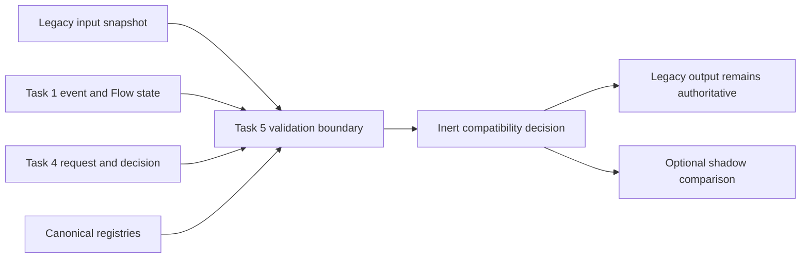

# Orchestrator Compatibility Boundary Contracts

## Status and purpose

Task 5 defines a versioned, typed and inert compatibility boundary between the
current VYVA handlers and the future Central Orchestrator. It is a Stage 1
precondition: legacy behavior becomes observable and comparable before any
production traffic can use new orchestration.

Task 5 does not route traffic, evaluate live flags, execute adapters, write
sessions, dispatch browser events, persist records, render UI, schedule work,
deliver responses or replace a legacy handler. Production integration requires
a separate reviewed milestone.

## Relationship to frozen contracts

The facade embeds frozen contracts instead of creating parallel models:

- Task 1 supplies the normalized `InteractionEvent` and current `FlowState`.
- Task 2 Specialist semantics remain available through Task 4.
- Task 3 supplies versioned Flow and scene references.
- Task 3.5 supplies Presentation and Channel constraints.
- Task 4 supplies the policy request and authoritative policy decision from
  which adapter authority must be derived.

Task 5 imports only shared contracts, never production runtime modules.

## Current legacy seams

`VYVA_LEGACY_SEAM_REGISTRY` identifies six boundaries:

| Seam | Current source | Compatibility concern |
|---|---|---|
| Voice agent contracts | `src/lib/voiceAgentContracts.ts` | agent domains, required context, entrypoints and plan identity |
| Voice session bridge | `src/lib/voiceSessionBridge.ts` | session identity, browser events and touch-answer bridging |
| Voice session state | `src/lib/voiceSessionState.ts` | derived session phase and labels |
| Voice engine | `src/social/voiceEngine.ts` | speech delivery and stop behavior |
| Current protocol facade | `src/triage/adapters/fromCurrentProtocol.ts` | legacy triage protocol exports |
| Route outcome | `src/triage/engine/routeOutcome.ts` | red flags, safety floor, fallback and route outcomes |

Entries contain declarative identifiers and source-path references, not
imported functions or clients. Each seam is versioned and declares bounded
inputs, outputs, effects, session semantics, criticality, comparison
eligibility and its legacy rollback target.

Registry version `1.0.0` is complete only when it contains exactly these six
IDs, once each, at supported seam version `1.0.0`. Missing, additional,
retired, duplicate or unsupported entries fail. Rollback targets must resolve
inside the same complete registry.

## Facade boundary

`CompatibilityEvaluationRequest` binds one legacy snapshot, normalized event,
active Flow state, Task 4 request and supplied Task 4 decision to one audit
correlation. Versions must match the supported frozen bundle. Snapshot time
must match audit capture time, and seam identity/version must exactly match the
canonical registry entry.

The duplicated Task 1 event and Flow state are parsed canonically on both
sides and compared as complete strict values. Correlation therefore covers
timestamps, Channel, locale, user/profile/session references, payload,
metadata, safety/consent context, lifecycle, expected input, pending Tool,
Flow context and update time—not only event ID or Flow ID/version.

`CompatibilityDecisionRecord` contains the observed legacy output, fixed
legacy-preservation disposition, optional non-executable adapter plans, shadow
comparison, evidence, supplied feature-flag snapshot, rollback recommendation,
safe failure and minimized observability.

## Compatibility modes

- `legacy_only` is valid and the default.
- `shadow_compare` is valid only for non-delivering comparison.
- `candidate_delivery` is modeled but cannot be effective in Task 5.
- `authoritative` is modeled but cannot be effective in Task 5.

Candidate or authoritative requests resolve only to legacy-only and declare
`future_contract_required`. Shadow mode fixes response, session and effect
preservation to `true`, fixes delivery authority to `legacy_handler`, and
rejects adapter delivery plans. An output snapshot may still record effects
that the existing handler performed; observation does not authorize repetition.
The public feature-flag parser also rejects effective `candidate_delivery` and
effective `authoritative`; evidence and rollback references cannot activate
them.

## Adapter authorization and non-broadening

An `AdapterAuthorizationPlan` is a proposal, never an execution command. It
links to the exact Task 4 decision, adjudications, findings, plans, directives,
source/target seam, correlation and audit record. Categories cover legacy
response/session, Channel, Presentation, Tool, memory, Flow state, audit and
escalation adapters.

Authority is a bounded vector covering Channels, targets, Tools, memory,
escalation, Presentation, scenes, Flows, response facts, medication
instructions, consent, session/browser effects, schedules, retry policy,
safety/privacy floors, confirmation, acknowledgement, disclaimers, claims,
audit, idempotency, timeouts and failures.

Validation applies non-broadening twice:

1. Source authority must be a subset of the exact applicable Task 4 subject,
   adjudication and authorization—not an aggregate of unrelated plans.
2. Every effect must be a subset of that source authority.

Array authority may only narrow. Safety/privacy ranks may only increase.
Required booleans and constraints may only be retained or strengthened.
Provider and execution authority are always false. Subject effects also require
their corresponding Task 4 authorization.

The vector includes Flow versions, Presentation versions, Tool authorization,
schema, result, risk classification, confirmation, idempotency and consent
references, memory subject/category/target/retention, exact escalation
Channel/urgency/target, session/browser effect kinds, required disclaimers and
prohibited claims.
Presentation privacy and safety ranks are derived from the approved
Presentation policy; safety/privacy findings and emergency authorization can
raise those floors. Rejected, deferred, unrelated or unadjudicated subjects
grant no effect authority. Every effect `sourcePlanId` must resolve.

Tool effects must exactly preserve their Task 4 Tool authorization and use the
proposal reference instead of raw arguments. Tool risk is derived through the
authorization's exact `proposalId` from the supplied Task 4 request's
`proposedToolCalls[].riskLevel`; source and effect authority must preserve that
exact `none | low | medium | high | emergency` value. Every Tool adapter plan
must carry exactly that risk even when it authorizes no effects; omission,
transformation, cross-Tool reuse and cross-request reuse fail. Escalation
effects must preserve authorization, type, target, Channel and urgency. Browser-event
effects must use a kind declared by their selected seam; a seam cannot inject
another seam's event vocabulary.

## Legacy effects

Legacy effects describe observed session-ID operations, session/browser
events, phase changes, response or speech delivery, route/fallback outcomes and
escalation outcomes. Each is inert, seam- and request-correlated, optionally
bound to the same session, and contains only opaque payload references.
Duplicate and cross-request effects are rejected.

## Shadow comparison and parity

Response, session, safety, routing, escalation, Presentation and effect
dimensions use: `exact_match`, `normalized_match`, `semantic_match`,
`approved_policy_difference`, `legacy_safer`, `canonical_safer`,
`incompatible`, `missing_legacy_evidence`, `missing_canonical_evidence` or
`not_comparable`.

Final classifications are `byte_equivalent`, `semantically_equivalent`,
`policy_approved_difference`, `safe_fallback_required`, `incompatible` and
`insufficient_evidence`.

The final classification is checked against a closed matrix across all seven
dimensions. `byte_equivalent` requires a present digest record on both sides
of every required dimension, supported `sha256`, exactly 64 lowercase
hexadecimal characters, matching canonicalization version, and identical
values. Two absent digests never match. Task 5 validates supplied digests and
does not hash data.

`VYVA_COMPARATOR_REGISTRY` fixes four deterministic, non-executable
comparators at version `1.0.0`: exact digest, normalized contract, semantic
fixture and policy difference. Unknown IDs or versions fail. Semantic matches
require registered deterministic comparator evidence. Policy differences
require registered policy-difference evidence and exact authority from the
versioned `VYVA_POLICY_DIFFERENCE_AUTHORITY_MATRIX`. Incompatible or missing
dimensions cannot be declared equivalent or policy-approved. Safety, consent
or privacy downgrades cannot be equivalent or approved.

Matrix V1 is deliberately narrow:

| Category | Dimension | Task 4 subject | Policy | Outcome | Required plan |
|---|---|---|---|---|---|
| `LEGACY_FORMAT_ONLY` | `response` | `response_guidance` | `policy.response_composition.allowed` | `allow` | `approvedResponsePlan` |

The referenced finding must identify the supplied Specialist response's exact
`<requestId>.response_guidance` subject, be included in an approving
adjudication, and be carried by the supplied response plan whose fact source
resolves to that same subject. The finding, adjudication, plan, Task 4 request
and Task 4 decision are all from the same compatibility request. Directives
authorize no V1 difference. Unrelated, rejected, deferred, unadjudicated or
confirmation-pending subjects fail, as do different dimensions, policies,
outcomes, subjects or plans. Request metadata cannot extend this matrix.

`VYVA_COMPARISON_POLICY_REGISTRY` is the authority for required dimensions,
allowed outcomes, required digests, comparators, permitted policy-difference
categories, maximum snapshot age and invariant requirements. Request equality
alone cannot establish policy authority. Comparisons bind to the same request,
output, Task 4 decision, seam, exact policy/version and audit record.
For response outcomes that depend on digest evidence, the supplied legacy
response digest and its inert provenance record must exist. The provenance
fixes algorithm `sha256` and canonicalization version `1.0.0`; both values and
the digest hex must exactly equal the response dimension's legacy digest.
Digest and provenance are required together. Structured response evidence
binds the canonical digest and response reference to the same compatibility
request and supplied Task 4 decision. For
`LEGACY_FORMAT_ONLY`, that evidence also preserves the approved response
plan's required disclaimers, prohibited claims and medication references, as
well as explicit safety, consent, privacy and emergency invariants. Task 5
validates this correlation; it does not compute a digest.

## Golden cases and evidence

Golden cases are synthetic, versioned fixtures referencing a real canonical
Flow/version, compatible Presentation/version, seam and Task 4 policy. They
declare expected parity, required invariants and allowed/prohibited
differences. Only approved cases support readiness.

Evidence binds one run and commit to the exact supported Task 1–5 versions,
legacy seam, comparator, comparison policy and approved golden case. Arbitrary
semantic versions are rejected. Accepted evidence must be current, match both
the approved golden expectation and current final parity, contain every
required safety, consent, privacy, session, routing, effect and audit invariant
exactly once, contain no unregistered extras, and pass every required
invariant.

Snapshot freshness is declarative: the resolved comparison policy currently
allows 300 seconds. Capture times cannot be in the future and stale input or
output snapshots fail even when IDs and audit timestamps otherwise correlate.
Validation uses supplied request/decision time or an injected validation time,
not an implicit wall-clock read.

## Feature flags, rollback and safe failure

Feature-flag state is supplied inert data, not live evaluation. Legacy-only is
always the default; percentage is bounded; deny-list wins; and shadow state
requires matching facade flag ID, comparison request, accepted complete
evidence and rollback plan. `incompatible`, `insufficient_evidence` and
`safe_fallback_required` parity cannot qualify. Task 5 cannot turn on or mutate
a flag.

Rollback is a recommendation toward a narrower mode and the registered legacy
seam. It cannot target authoritative mode, invent a handler, suppress emergency
handling or audit, or restore revoked consent. Its finding/evidence references
must resolve locally. Safe failures expose fixed public codes, bounded
classifications, recommendations and correlated references. Task 5 performs
neither rollback nor fallback. Safe-failure classification determines one
fixed public error code; arbitrary classification/code pairing fails, and
safety/consent/audit failures require manual-review guidance.

## Version, reference and audit integrity

Request-aware validation rejects unknown/incompatible versions, stale snapshot
correlation, retired/unknown seams, dangling Task 4 references, duplicate IDs,
direct adapter-plan self-reference, cross-request references, missing evidence
and contradictory observability. It does not claim arbitrary multi-hop cycle
detection.

Metadata is strict, bounded and recursively scanned through nested objects and
arrays. Raw transcript, audio, image/document content, Tool arguments,
provider payloads, credentials, secrets, tokens, authorization headers, hidden
reasoning and financial account data are rejected. Executable provider,
client, endpoint, URL/URI, webhook, connection, host, socket, transport,
executor, invocation, handler and adapter-instance keys are also rejected
after case-insensitive key normalization. Network or executable URL schemes,
UNC paths, connection strings, host-and-port destinations, data URIs and
token-bearing values fail under every key.

High-confidence JWT, Google API key, GitHub token, generic access/API/secret
assignment, private-key marker, Basic authorization and credential-bearing
connection-string shapes are rejected even under neutral keys. JWT-like
matching is structural rather than header-prefix-dependent: exactly three
non-empty base64url segments of 8–128 characters each within the bounded
metadata string are rejected. Exact segment count and minimum length preserve
short dotted reason codes, versions and declarative semantic IDs. This
deterministic matching is defense in depth, not comprehensive secret scanning;
Task 5 does not decode JWT segments, verify JWT signatures, inspect JWT claims,
or perform cryptographic JWT validation; it only applies bounded structural
credential-shape detection as deterministic defense in depth.
Ordinary token-policy prose and safe UUIDs, digests, timestamps, reason codes,
versions and opaque references remain permitted. Failures never echo detected
values.

Declarative keys such as `endpointPolicy`, `providerPolicy`,
`clientCapabilityRequired`, `urlPolicy` and `opaqueProviderReference` remain
valid only when their values are inert. `sourcePathReference` is permitted
only in the dedicated legacy-seam descriptor, where it must be
repository-relative, traversal-free and non-URL. It is rejected in every
generic metadata location, including normalized case and separator variants.
Parser failures use typed `OrchestrationContractError` codes with fixed
messages and do not echo input.

Exported low-level Zod schemas provide structural composition only. They do
not authorize readiness, adapter effects, evidence, flags or rollback.
Semantic entry points are the typed parsers; any decision claiming
request-bound compatibility must additionally pass
`validateCompatibilityDecisionForRequest`.

## Future integration responsibilities

A separate approved milestone must own live seam capture, freshness policy,
feature-flag authority, shadow isolation and resource limits, comparison
execution, evidence persistence, adapter implementation and execution,
response/session preservation, idempotency, monitoring and operational
rollback. No Task 5 contract is a handler, adapter, flag service, telemetry
client, persistence component or delivery mechanism.
