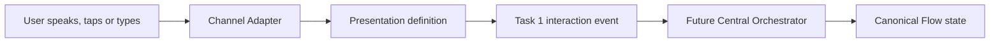

# Canonical Versioned Presentation Registry

## Purpose

Task 3.5 defines the inert, provider-neutral presentation layer between
canonical Flow semantics and future Channel Adapter rendering. It describes
what a user may see, hear and do without importing React components,
voice-provider commands, runtime callbacks or executable behavior.

The registry is not a router, renderer, design system or orchestration runtime.
It is validated data that a future Central Orchestrator and Channel Adapter may
interpret after separate runtime-integration approval.

| Participant | Responsibility |
| --- | --- |
| Flow Catalogue | Defines what the user is doing through versioned Flows and semantic scenes |
| Presentation Registry | Defines approved ways that a semantic moment may be presented |
| Specialist | Proposes UI and response guidance but does not render |
| Central Orchestrator | Approves the presentation, content, actions and policy |
| Runtime adapter | Eventually renders synchronized screen and voice |
| User interaction | Emits canonical Task 1 events |

## Family and presentation definitions

A presentation family is a stable semantic pattern such as a single choice,
scale, evidence capture or emergency escalation. A presentation definition is
a versioned, Flow-bound use of a family.

Families declare supported answer kinds, UI instruction types, Channels and
device classes. Definitions add:

- a stable `presentationId`, semantic version and lifecycle status;
- a Task 3 Flow and scene binding;
- localized content-slot keys;
- supported Channels and devices;
- expected Task 1 input;
- semantic actions and event mappings;
- voice/screen synchronization;
- accessibility and localization policy;
- privacy, safety, fallback and design-reference metadata.

Only one version of a presentation ID may be current. `draft` may be current
as architecture data but is not runtime-eligible; `approved`, `pilot` and
`active` may be current; `deprecated` and `retired` cannot be current.
Replacements and fallbacks must resolve within the same registry. References
and cycles are validated before the registry can be consumed.

## Versioning, deprecation and migration

Presentation and family identity uses stable namespaced IDs plus semantic
versions. Colour, spacing and wording improvements may be compatible revisions.
Changing required actions, event mappings, expected inputs, privacy behavior or
safety treatment is a breaking change.

Compatibility metadata records the minimum compatible version, breaking-change
status, deprecated versions, migration policy and optional replacement.
Deprecated and retired entries cannot be current. A future Central Orchestrator
may select only eligible approved, pilot or active versions and should keep an
active session bound to the version it started with where appropriate.
Migration selection and execution are intentionally not implemented.

## Flow and scene binding

Every definition references a current Task 3 Flow and one of its declared
semantic scenes. It must stay within the Flow's Channel and expected-input
capabilities. Some frozen Task 3 Flows currently expose broad `.main` scenes;
Task 3.5 therefore binds several narrower presentation steps to the same
canonical scene while retaining distinct presentation IDs. It does not rewrite
or reinterpret the frozen Flow catalogue.

## Input and event mapping

Interactive definitions reuse Task 1's discriminated expected-input contract.
They require actions, bounded event mappings, an answer-producing mapping and
explicit current-question, current-scene and current-Flow-version correlation.
Action-bound input and explicitly marked passive input are distinguished.
Choice presentations allow voice, touch and text to resolve only to the
expected canonical option set.

Mappings are checked against Task 1 event semantics, including event type,
source, modality and trigger source. Their payload declarations are bounded,
discriminated references; they contain no transforms or normalization code.
Question, scene and Flow-version correlation is part of the mapping rather
than an implicit UI convention.

## Voice and screen synchronization

Voice behavior is expressed semantically: which localized content slot may be
spoken, whether visual content is synchronized with speech, whether
interruption is allowed, which aliases resolve to canonical options and what
happens when speech is unavailable.

There are no ElevenLabs IDs, provider payloads, audio URLs or executable voice
handlers in the registry. A future Channel Adapter owns provider translation.

## Content, actions and visual behavior

Content slots contain localization keys, roles and sensitivity rather than raw
user data or provider output. Actions use a bounded semantic vocabulary.
Definitions cannot contain direct Tool execution, memory writes, caregiver
notifications, API calls, callbacks or React implementations.

Visual behavior describes layout intent, focus, progress, emphasis and
responsive behavior. It is not a component tree and does not prescribe a
specific frontend framework.

## Channels and devices

The registry distinguishes Channel compatibility from device compatibility.
Supported Channels are inherited from the frozen Task 3 vocabulary. Device
classes cover phone, tablet, desktop, telephone and shared displays.

Definitions must be compatible with both their family and Flow. Device-specific
experiences require a safe fallback. The frozen Task 3 medication Flow does not
currently advertise telephone, and its notification-resume Flow is PWA-only;
Task 3.5 records rather than overrides those limitations. A separate
`engagement.outbound_call` presentation proves the frozen telephone Channel
contract without falsely adding telephone support to Medication.

## Accessibility

Every definition declares screen-reader labeling, focus behavior, minimum touch
targets, text scaling and contrast intent, reduced-motion behavior, non-colour
status cues, repetition support and captions for spoken content. Voice-only
instructions are not treated as a substitute for accessible visual or touch
interaction.

## Localization

User-facing copy is referenced through localization keys. Definitions declare
supported locales, a default locale and a missing-translation strategy.
Required content slots must have keys. Option aliases are deliberately
locale-neutral in Task 3.5: a voice-enabled option presentation either provides
bounded, unambiguous aliases for every option or explicitly uses canonical
localized option labels as speech aliases. Raw provider errors and unbounded
generated copy do not belong in this layer.

## Privacy

Privacy policy includes content sensitivity, shared-device behavior, capture
retention and screenshot/recording handling. Task 3.5 declares image/document
expected-input and declarative asset-reference field mapping policy. The
registry contains no uploaded assets and does not directly parse Task 1 asset
references; actual uploaded references remain governed by Task 1 and future
runtime handling. Binary data, local paths and unrestricted URLs are not
registry fields.

## Safety

Safety-critical definitions declare precedence, interruption behavior,
acknowledgement requirements and a safe fallback. Emergency presentation cannot
be suppressed by ordinary Flow presentation. Scam classifications preserve the
Task 3 distinction between `no_obvious_indicators` and a guarantee of safety.
Presentation metadata cannot authorize escalation, Tool action or memory write.

## Fallbacks

Fallbacks are explicit registry references. Source and fallback must share a
Flow; the fallback scene must exist in that shared Flow; expected input must
remain answer-kind compatible or become explicitly noninteractive; and the
pair must share a Channel or device path. Validation compares the required
privacy and safety monotonicity dimensions listed in the contract, including
set-valued prohibitions/disclaimers, and rejects cycles. A fallback is
presentation degradation only; it cannot select or start another Flow.

## Design references

Optional design references use stable, provider-neutral identifiers and bounded
metadata. They are traceability hints, not runtime component imports or
external provider clients.

## Metadata boundary

Metadata is recursively checked after each key is normalized by lowercasing and
removing non-alphanumeric separators. Exact reserved keys reject hidden
reasoning, clinical or Trust decisions, execution directives, credentials and
generic tokens, authorization headers, live adapters and provider clients at
any nesting level, including arrays. The policy deliberately does not use
substring matching: declarative fields such as `adapterPolicy`, `tokenPolicy`,
`migrationAdapterId`, `providerNeutral` and `runtimeResponsibility` remain
valid.

## Initial presentation families

The required initial families are:

- `presentation.family.introduction`
- `presentation.family.choice.yes_no`
- `presentation.family.choice.single`
- `presentation.family.choice.multiple`
- `presentation.family.input.scale`
- `presentation.family.input.free_text`
- `presentation.family.input.measurement`
- `presentation.family.confirmation`
- `presentation.family.progress`
- `presentation.family.summary`
- `presentation.family.consent`
- `presentation.family.capture.image`
- `presentation.family.capture.image_retake`
- `presentation.family.capture.document`
- `presentation.family.capture.screenshot`
- `presentation.family.tool_confirmation`
- `presentation.family.waiting_for_tool`
- `presentation.family.followup_choice`
- `presentation.family.interruption`
- `presentation.family.resume`
- `presentation.family.safety.warning`
- `presentation.family.safety.escalation`
- `presentation.family.error.safe_fallback`
- `presentation.family.expired_or_stale`

## Reference experiences

| Experience | Status in Task 3.5 |
| --- | --- |
| Preventive Health | Covered: introduction, questions, scale, interruption, resume, restored progress, summary and telephone-compatible definition |
| Medication | Covered for reminder/confirmation. Medication-specific outbound call is deferred because frozen Task 3 Medication Flows do not declare `telephone`/`outbound_call`; a future Task 3 Medication Flow revision must add that Channel, trigger and scene. |
| Wound | Covered: consent, capture, upload fallback, quality failure, retake, context and summary |
| Scam | Covered: evidence choice/capture, privacy-safe capture fallback, exposure questions, immediate actions, escalation and non-guaranteeing outcomes |
| Emergency | Covered on frozen supported Channels. Telephone voice-only emergency is deferred because `safety.emergency_check` does not declare `telephone`; a future Task 3 Safety Flow revision must add that Channel and a compatible continuation scene. |
| Notification Resume | Covered on frozen PWA Channel. Push-to-voice continuation is deferred because `engagement.notification_resume` is PWA-only and has no voice/telephone continuation scene; a future Task 3 Engagement revision must add those semantics. |

These are contract examples only. They do not make any experience live.
The generic `engagement.outbound_call` definition is not evidence of Medication,
Emergency or Notification Resume channel coverage. No deferred scenario has
runtime support.

## Extension procedure

To add a presentation safely:

1. Confirm the Flow, version, scene, Channel and input kind exist in Task 3.
2. Reuse a family or add a narrowly defined provider-neutral family.
3. Assign a stable presentation ID and semantic version.
4. Use localization keys for all user-facing slots.
5. Declare expected input and all Task 1 event mappings.
6. Keep canonical option IDs identical across voice, touch and text.
7. Declare semantic actions only.
8. Define voice/screen synchronization.
9. Declare supported Channels and devices.
10. Complete accessibility requirements.
11. Complete localization requirements.
12. Classify privacy and shared-device behavior.
13. Declare safety precedence and acknowledgement behavior.
14. Add safe, non-cyclic fallbacks where required.
15. Add fixtures and positive, negative and cross-reference tests.
16. Validate the complete registry before proposing runtime integration.

## Runtime isolation

Task 3.5 is disconnected from production runtime. No routing, API, database,
React, voice, AI, provider or service-worker module imports it. Runtime
interpretation, feature flags, rendering and delivery require a later approved
task.

A presentation does not execute, reason, diagnose, select a Flow, write memory,
contact a human or schedule work. Capabilities support Flows but do not control
presentations. A Figma frame is not production code; design artifacts attach to
stable presentation IDs and may change without changing those IDs.

## Validation API

Public callers should use `parsePresentationRegistry` and
`validatePresentationEventMapping`, which convert ordinary validation failures
to fixed-message `OrchestrationContractError` values without echoing submitted
content. Directly exported low-level Zod schemas are available for composition
and may return ordinary Zod errors; the typed-error guarantee applies at the
public parser/validator boundary.
